# 事件中心盲区系统 Agent 实施 SOP

_基于 `event_centered_blind_spot_implementation_spec.md` 与 `parallel_acceleration_implementation_plan.md` 的可派发任务分解，2026-07-15_

> **For agentic workers:** 按本文任务逐项实施。每个任务必须独立阅读自己的“输入契约、禁止事项、SOP、验收标准和交付物”，使用复选框记录进度。实现时优先采用测试驱动；若后续启用 Agent 编排，使用 `subagent-driven-development` 或 `executing-plans` 逐任务执行。

**目标：** 从 THÖR-MAGNI 真实机器人与动态对象轨迹出发，构建无数据泄漏的事件中心半合成盲区数据、轨迹条件风险学习、风险校准、反事实验证价值学习以及 `execute / verify / reject` 离线闭环。

**架构：** 先冻结数据契约、坐标系、时间网格和 toy fixture，再让数据、几何、规划、风险模型、验证价值和评估工作流并行开发。所有工作流只通过版本化 schema、manifest 和结构化产物连接；模型输入与 oracle 标签信息在类型和存储层面分离。

**技术栈：** Python 3.10+、NumPy、PyTorch、PyYAML、pytest；第一版存储采用压缩 NPZ shards + JSONL metadata，Zarr/Parquet 仅作为不阻塞主线的增强项。

---

## 📋 1. 使用边界与权威来源

### 1.1 权威顺序

发生冲突时按以下顺序处理：

1. 科学语义、公式、可见性与泄漏约束以 [`event_centered_blind_spot_implementation_spec.md`](./event_centered_blind_spot_implementation_spec.md) 为准
2. 并行边界、最低门槛、降级方案和波次以 [`parallel_acceleration_implementation_plan.md`](./parallel_acceleration_implementation_plan.md) 为准
3. 本文负责消除两份文档间的工程歧义，作为 Agent 实施时的任务入口
4. 若实现必须改变冻结契约，先记录到 `DECISIONS.md`，再由总控 Agent 批准；执行 Agent不得自行变更

### 1.2 第一版必须完成

- 2D BEV、差速运动学、通用动态对象、矩形/柱状遮挡和结构性 FOV 盲区
- 按冻结 split policy 先切分，再在各 split 内独立建 snippet、base state 和样本
- 六类配对事件、隐藏风险 GT、occupancy baseline、轨迹条件风险模型和校准
- scenario bank、验证动作、验证后重规划、净验证价值 `G*` 和价值模型
- `execute / verify / reject` 离线或轻量 2D 闭环
- 可追溯配置、manifest、指标、案例图、失败样本和实验汇总

### 1.3 第一版禁止扩张

- 不解析 RGB/原始点云，不做端到端感知
- 不做端到端强化学习控制
- 不让 Social-STGCNN、Trajectron++、Arena ROS2、JRDB 或复杂 attention 阻塞 P0 主线
- 不把 continuous risk 称为真实概率
- 不把 scenario bank 或 `G*` 称为严格 Bayes ground truth
- 不声称无条件安全保证或半合成分布等价于真实世界

### 1.4 当前环境约束

- 当前目录尚未初始化 Git，本文不包含 commit/PR 步骤
- 多 Agent 并行时必须按“文件所有权”隔离，禁止两个 Agent 同时改同一文件
- 在没有 worktree 的情况下，建议每个时刻只允许一个 Agent 写共享文件；其他 Agent仅写各自模块目录
- 初始化 Git、创建分支或提交不属于本文自动执行范围

---

## 🔐 2. 必须先冻结的全局契约

### 2.1 坐标、时间与几何

| 契约 | 固定值 |
| --- | --- |
| 局部原点 | 当前机器人几何中心 |
| 局部 `+x` | 机器人当前前方 |
| 局部 `+y` | 机器人当前左侧 |
| 长度/角度 | 米 / 弧度 |
| 历史窗口 | `K=8`、`dt=0.2 s`，含当前点时覆盖 `-1.4...0.0 s` |
| 未来窗口 | `T=15`、`dt=0.2 s`、总长 `3.0 s` |
| BEV 范围 | `[-8, 8] m × [-8, 8] m` |
| BEV 分辨率 | `0.1 m`，`H=W=160` |
| 机器人尺寸 | `0.70 m × 0.55 m`，膨胀 `0.15 m` |
| 动态对象尺寸 | `human` 圆半径 `0.30 m`（Carrier `0.45 m`）；其余类型使用 QTM marker P95 矩形或配置 fallback |
| age map | `A_max=5.0 s`，未见 `1.0`，当前可见 `0.0` |

### 2.2 类型隔离决策

原始规格中的 `BaseState` 同时出现 observed 与 oracle 字段，而并行计划中的版本未明确 oracle future。为防止未来信息泄漏，schema v2 冻结为三个层次：

```python
@dataclass(frozen=True)
class BaseState:
    state_id: str
    split: str
    recording_id: str
    dynamic_object_ids: tuple[str, ...]
    timestamp: float
    robot_history: np.ndarray
    robot_state: np.ndarray
    visible_dynamic_object_history: dict[str, np.ndarray]
    visible_dynamic_object_specs: dict[str, dict]
    static_map_local: np.ndarray | None
    metadata: dict


@dataclass(frozen=True)
class OracleContext:
    base_state_id: str
    dynamic_object_history: dict[str, np.ndarray]
    dynamic_object_future: dict[str, np.ndarray]
    dynamic_object_specs: dict[str, dict]
    metadata: dict


@dataclass(frozen=True)
class OracleWorld:
    world_id: str
    base_state_id: str
    static_occupancy: np.ndarray
    dynamic_object_trajectories: dict[str, np.ndarray]
    dynamic_object_specs: dict[str, dict]
    occluders: tuple[dict, ...]
    blind_spot_config: dict
    random_seed: int
    metadata: dict
```

`RiskSample` 和 `VerificationSample` 只能包含部署时可获得的输入、监督标签及溯源 metadata；不得包含 `OracleContext`、隐藏动态对象未来位置或验证后真实 occupancy。

动态对象类型冻结为 `human`、`carried_object`、`unknown_dynamic`。适配器必须保留所有非机器人 BODY，不得用行人 allow-list 排除 `storage/cart/carrier/LO*` 等对象；原始 body name/role 仅进入 provenance。对象 ID 使用 `recording_id::body_name`，footprint spec 只允许圆或矩形，并与轨迹 key 严格对齐。适配完成后，下游只能消费 contract 冻结的 `object_type` 和 footprint spec，禁止根据 body name、role 或文件名重新分类或重估 footprint。schema v1 产物不兼容，必须重建。

### 2.3 随机性与 ID

- 所有入口接受 `--config`、`--seed`、`--output-dir`
- 跨进程 ID 和子种子使用 SHA-256/BLAKE2 等稳定摘要，不使用 Python `hash()`
- `sample_id` 由 split、源 recording、base state、trajectory、variant/action 和 seed 派生
- 同源配对样本共享 `pair_group_id`
- 生成重跑必须产生相同 ID、相同数组和相同 metadata 顺序

### 2.4 存储与 manifest

每个数据产物必须有适用于自身阶段的基础字段：

```text
schema_version
split
config_digest
generator_seed
source_recording_ids
source_participant_ids
sample_count
accepted_count
rejected_count
rejection_reasons
array_shapes
array_dtypes
nan_inf_counts
created_at
code_version
```

不适用于当前阶段的字段必须省略，不得伪造空语义。SOP-03 及之后的 typed 动态对象
产物增加 `source_dynamic_object_ids` 和按 object type 的计数；SOP-05 及之后的事件、
数据、checkpoint、calibration 和评测产物增加 `target_object_type_counts` 与
`target_type_policy_digest`。

`target_type_policy` 是 generator config 中目标类型白名单和三类对象完整权重映射。
解析后权重必须有限、非负，白名单外权重归零，白名单内至少一项为正，再归一化为和
为 1 的确定顺序映射。主论文默认白名单为 `[human]`，完整权重为
`human=1.0, carried_object=0.0, unknown_dynamic=0.0`。对解析后 policy 做规范化序列化
并计算稳定 digest；所有下游产物必须逐级传播并校验该 digest。

当前无 Git 时 `code_version` 写 `unversioned`，不得伪造 commit；初始化 Git 后再记录真实 commit。

### 2.5 模型输入通道

输入通道顺序必须在 `src/contracts.py` 中定义为常量并写入 checkpoint：

```text
past_dynamic_occupancy[K]
past_visible_mask[K]
current_visible_free
current_visible_occupied
current_unobservable_mask
last_seen_occupancy
occlusion_age_map
static_obstacle_map
robot_footprint
robot_velocity_channel
robot_yaw_rate_channel
swept_volume_mask
time_to_arrival_map
braking_margin_map
centerline_map
```

任何新增、删除或重排通道都视为 schema 变更。

---

## 🔗 3. 依赖 DAG 与并行波次

```mermaid
flowchart LR
    accTitle: Agent SOP Dependency Graph
    accDescr: Seventeen implementation tasks grouped into foundation, risk, verification, and evaluation lanes with explicit dependencies and parallelizable branches

    subgraph foundation ["🔧 Foundation"]
        sop00[Freeze contracts and toy]
        sop01[Build split manifests]
        sop02[Implement geometry kernel]
        sop03[Adapt THÖR data]
        sop04[Generate local trajectories]
        sop00 --> sop01
        sop00 --> sop02
        sop00 --> sop04
        sop01 --> sop03
        sop02 --> sop03
    end

    subgraph generation ["⚙️ Event generation"]
        sop05[Compose hidden events]
        sop06[Render paired BEV]
        sop07[Build risk labels]
        sop03 --> sop05
        sop04 --> sop05
        sop02 --> sop05
        sop05 --> sop06
        sop04 --> sop07
        sop06 --> sop07
    end

    subgraph risk ["🧠 Risk learning"]
        sop08[Train risk baselines]
        sop09[Train risk model]
        sop10[Calibrate risk outputs]
        sop07 --> sop08
        sop07 --> sop09
        sop08 --> sop10
        sop09 --> sop10
    end

    subgraph verification ["🔍 Verification value"]
        sop11[Simulate verify actions]
        sop12[Compute scenario value]
        sop13[Build value dataset]
        sop14[Train value model]
        sop02 --> sop11
        sop04 --> sop11
        sop06 --> sop12
        sop07 --> sop12
        sop11 --> sop12
        sop12 --> sop13
        sop13 --> sop14
    end

    subgraph evaluation ["📊 Decision and evidence"]
        sop15[Run decision closed loop]
        sop16[Run experiment matrix]
        sop10 --> sop15
        sop14 --> sop15
        sop15 --> sop16
    end
```



### 3.1 推荐波次

| 波次 | 可并行任务 | 合流门禁 |
| --- | --- | --- |
| Wave 0 | SOP-00 | G0 契约门禁 |
| Wave 1 | SOP-01、02、04；SOP-03 在 split 契约后启动 | G1a 基础几何/数据门禁 |
| Wave 2 | SOP-05、06、07；SOP-08/09 用 toy 数据提前开发；SOP-11 用 toy world 开发 | G1 数据生成门禁 |
| Wave 3 | SOP-08、09、10 与 SOP-12、13、14 两条线并行 | G2 风险门禁、G3 验证门禁 |
| Wave 4 | SOP-15；SOP-16 可先用 oracle/mock 输出搭框架 | G4 闭环门禁 |
| Wave 5 | SOP-16 全实验、消融、图表和复核 | G5 论文证据门禁 |

### 3.2 安全并发度

- 理论最大并发：7 条工作流
- 当前无 Git/worktree 的安全并发：最多 4 个写 Agent，且文件所有权完全不重叠
- `src/contracts.py`、`configs/base.yaml`、`DECISIONS.md` 只允许 SOP-00 总控 Agent 修改
- `src/generation/observation_renderer.py` 同时被多个下游依赖，但只归 SOP-06 所有
- `src/evaluation/risk_metrics.py` 只归 SOP-10 所有，其他 Agent只能调用
- `src/evaluation/verification_metrics.py` 只归 SOP-14 所有
- 任何跨所有权改动先写接口变更请求，不直接编辑

---

## ✅ 4. 全局门禁与完成定义

### 4.1 G0：契约门禁

- schema 可序列化、反序列化并保持 shape/dtype/ID
- toy fixture 覆盖空盲区、碰撞、near miss、temporal-safe、正价值动作和负价值动作
- toy 风险标签、可见性和 `G*` 有人工枚举答案
- 一个 risk batch 和一个 verification batch 可完成模型 forward
- 全部随机过程同 seed 重跑逐元素一致

### 4.2 G1：数据生成门禁

- split 泄漏检测为 0
- 最低 `base states ≥ 2,000`、`snippets ≥ 1,000`
- 最低事件接受率 `≥ 50%`
- 至少稳定生成 collision、near-miss、temporal-safe、empty 四类
- 最低 risk samples `≥ 50,000`
- 目标动态对象当前不可见、未来出现、真实 footprint 不穿墙，遮挡物不阻塞机器人扫掠体
- 100 个可视化样本人工检查无系统性错误

### 4.3 G2：风险门禁

- last-observation、age-decay、occupancy + aggregation 三类 baseline 使用同一 split
- risk model 最低 Collision AUROC `≥ 0.80`
- 校准后 90% coverage 位于 `85%–95%`
- false-safe 相对 occupancy baseline 至少降低 `10%–15%`
- 至少一个 hard-negative 子集优于 occupancy aggregation

### 4.4 G3：验证价值门禁

- 6 个验证 primitive
- scenario bank `M=8` 或 `16`
- 最低 verification samples `≥ 10,000`
- 正价值和负价值样本各不少于 20%
- Useful-action F1 `≥ 0.65`
- Pairwise ranking accuracy `≥ 0.65`
- Top-1 regret 优于 visible-area 与 swept-coverage baseline
- `G*` 成本只扣一次，verify 后从新位姿重规划

### 4.5 G4：闭环门禁

- learned value 至少在一个固定验证预算下优于 visible-area
- risk calibration 明显降低 false-safe execution
- 输出有效 safety-efficiency Pareto
- 输出 5–10 个成功/失败案例
- 每个 episode 记录决策、风险、价值、验证次数、拒绝原因和终止状态

### 4.6 G5：论文证据门禁

- 主结果至少 1–3 个种子，理想为 3 个
- 至少一套完整消融
- scenario bank `M`、posterior temperature、验证成本敏感性可追溯
- 所有表格和图从结构化结果自动生成
- 所有数字可追溯到 config、manifest、seed、checkpoint 和 metrics
- 失败样本不被静默丢弃

---

## ⚙️ 5. 所有 Agent 共用执行 SOP

每个子任务必须按以下顺序执行，不允许只提交实现而没有证据。

1. **读取契约**
   - 只读取本任务列出的源文档章节、`src/contracts.py` 和依赖任务 handoff
   - 确认输入 schema version、shape、dtype、坐标系和单位
2. **建立最小失败测试**
   - 先写 1–3 个可人工核算的 fixture 测试
   - 运行测试并确认因目标能力缺失而失败，而非环境错误
3. **实现纯函数核心**
   - 优先实现无文件 I/O 的纯函数
   - 随机数通过显式 `np.random.Generator` 传入
   - 不使用模块级隐式随机状态
4. **实现 I/O 与 CLI**
   - CLI 只做参数解析和流程编排
   - 所有输出写入 `--output-dir`
   - 重要文件使用临时文件 + 原子 rename，避免部分产物被视为成功
5. **运行分层验证**
   - 单元测试
   - toy fixture 集成测试
   - 10–100 样本 smoke test
   - 达到本任务规模门槛后才运行下游
6. **执行数据审计**
   - schema、shape、dtype、NaN/Inf、范围、时间对齐、mask 关系、样本计数
   - 对生成失败输出结构化 rejection reason
7. **生成 handoff**
   - 代码、最小配置、测试命令、smoke 命令
   - 10–100 个 fixture 输出
   - manifest、运行时间、峰值内存和已知限制
8. **停止条件**
   - 任一科学不变量失败，不得用放宽断言、跳过样本或硬编码标签继续
   - 接口不一致时停止并向 SOP-00 请求决策

统一 handoff 格式：

```markdown
## SOP-XX handoff
- Status: pass | blocked | degraded
- Inputs:
- Outputs:
- Commands:
- Tests:
- Metrics:
- Rejected samples:
- Runtime and memory:
- Contract changes requested:
- Known limitations:
- Safe next task:
```

---

## ✍️ 6. SOP-00：工程契约、配置、确定性与 toy fixture

### 目标与所有权

- **优先级：** P0，所有任务的唯一前置
- **所有权：** `src/contracts.py`、`src/utils/`、`configs/base.yaml`、toy fixture、`STATUS.md`、`DECISIONS.md`
- **完成后解除阻塞：** SOP-01、02、04、08/09 骨架、11 骨架、16 指标骨架

### 文件

- Create: `src/contracts.py`
- Create: `src/utils/config.py`
- Create: `src/utils/seeding.py`
- Create: `src/utils/logging.py`
- Create: `configs/base.yaml`
- Create: `tests/fixtures/toy_world.py`
- Create: `tests/test_contracts.py`
- Create: `tests/test_toy_fixture.py`
- Create: `scripts/00_validate_contracts.py`
- Create: `STATUS.md`
- Create: `DECISIONS.md`

### SOP

- [ ] 定义 `SCHEMA_VERSION`、所有 dataclass、通道顺序、shape/dtype 检查器
- [ ] 分离 `BaseState`、`OracleContext` 和 `OracleWorld`
- [ ] 实现 dataclass 与 NPZ/JSON 可逆序列化，不序列化 Python 对象数组
- [ ] 实现稳定 ID 和分层 seed 派生；证明不依赖进程顺序
- [ ] 实现配置加载、默认值、未知字段拒绝和配置 digest
- [ ] 创建 4 个 base states、每个 6 条轨迹、4 个 worlds、4 个动作的固定 toy fixture
- [ ] 给 toy fixture 写人工答案：collision、min clearance、visibility、exact `G*`
- [ ] 提供一个最小 risk batch 和 verification batch
- [ ] 记录“冻结字段”和变更审批流程到 `DECISIONS.md`

### 验收

- `pytest tests/test_contracts.py tests/test_toy_fixture.py -q` 全部通过
- 序列化前后数组逐元素相等，dtype 和 shape 完全一致
- 同 seed 两次生成的 fixture digest 完全一致；不同 seed 至少一个 stochastic 字段变化
- 模型输入对象中不存在 `oracle_*`、hidden future 或 post-verification occupancy
- `python scripts/00_validate_contracts.py --config configs/base.yaml` 返回 0，并输出 schema summary
- toy fixture 可由所有后续任务读取，不依赖 THÖR 原始数据

### 禁止与降级

- 禁止为 toy 答案硬编码生产函数输出
- 若 Zarr/Parquet 依赖未就绪，立即使用 NPZ + JSONL
- 当前无 Git 时 provenance 写 `unversioned`，不得阻塞

---

## ✍️ 7. SOP-01：分组切分、泄漏审计与 manifest

### 目标与依赖

- **优先级：** P0
- **依赖：** SOP-00
- **输入：** recording/session/participant 索引，不需要生成任何样本
- **输出：** 冻结的 train/calibration/val/test group manifest

### 文件

- Create: `src/datasets/split_manager.py`
- Create: `scripts/00_make_splits.py`
- Create: `configs/data_thor.yaml`
- Create: `tests/test_split_manager.py`
- Create: `tests/test_split_leakage.py`

### SOP

- [ ] 定义 group key 优先级：`recording_id → session_id → participant_id → scene_id`
- [ ] 实现确定性 group-level split，默认比例 `70/10/10/10`
- [ ] 检查 participant 跨 recording 时的连通分量，确保同一主体不跨 split
- [ ] 为每个 split 派生独立 generator seed namespace
- [ ] 输出 group manifest、统计摘要和 overlap report
- [ ] 实现 snippet source、base state source、pair group 和 generator seed 的泄漏审计 API
- [ ] 对 toy manifest 写“相邻帧不能随机跨 split”的回归测试
- [ ] 将 manifest digest 写入所有后续产物

### 验收

- `pytest tests/test_split_manager.py tests/test_split_leakage.py -q` 全部通过
- 通用默认策略要求 recording/session/可用 participant 交集均为 0
- THÖR 显式采用 `unseen_recording_within_known_sessions`：recording 交集为 0、
  recording-day session overlap 完整枚举且允许、participant 标记 unavailable
- 相同输入与 seed 重跑 manifest 字节级一致
- 任意 group 不被拆分
- 比例偏差在 group 粒度可实现范围内，并报告实际比例
- 泄漏检测器对人工注入的重复 recording、participant、snippet 和 seed 均能失败

### 运行

```bash
python scripts/00_make_splits.py \
  --config configs/data_thor.yaml \
  --seed 42 \
  --output-dir outputs/splits
```

### 降级

- participant ID 缺失时按 recording 隔离并在 manifest 标记 `participant_check=unavailable`
- 不允许退化为 sample-level 随机切分

---

## ✍️ 8. SOP-02：几何、栅格化、碰撞与可见性内核

### 目标与依赖

- **优先级：** P0
- **依赖：** SOP-00
- **输出：** 所有生成、规划、标签和验证共用的唯一几何实现

### 文件

- Create: `src/geometry/transforms.py`
- Create: `src/geometry/footprints.py`
- Create: `src/geometry/rasterization.py`
- Create: `src/geometry/raycasting.py`
- Create: `src/geometry/collision.py`
- Create: `tests/test_transforms.py`
- Create: `tests/test_footprints.py`
- Create: `tests/test_rasterization.py`
- Create: `tests/test_raycasting.py`
- Create: `tests/test_collision.py`

### SOP

- [ ] 实现 global↔local SE(2) 变换、yaw unwrap 和时间插值
- [ ] 统一 world-to-grid 取整规则、cell center 约定和边界策略
- [ ] 实现圆形/矩形 footprint、膨胀、shape intersection 和 signed clearance
- [ ] 实现 footprint 扫掠栅格化
- [ ] 实现静态 occupancy + FOV + range 的 deterministic ray casting
- [ ] 明确定义遮挡物 cell 本身可见、其后方 cell 不可见
- [ ] 对越界、空地图、贴边相切、角度跨 `±π` 写测试
- [ ] 基准测试 160×160 单帧 ray casting 和 15 帧碰撞计算

### 验收

- SE(2) 往返位置误差 `<1e-4 m`，角度误差 `<1e-5 rad`
- 变换前后点对距离保持
- 插值后时间单调、无重复时间戳、yaw 无跳变
- 直线、圆、矩形相交和相切结果与人工解析答案一致
- 遮挡物后 cell 不可见，FOV 外和 range 外 cell 不可见
- swept volume 覆盖每个时刻的完整膨胀 footprint
- `pytest tests/test_transforms.py tests/test_footprints.py tests/test_rasterization.py tests/test_raycasting.py tests/test_collision.py -q` 全部通过

### 禁止

- 下游任务不得各自实现第二套坐标转换、collision 或 ray casting
- 不允许通过图像库默认坐标系隐式交换 x/y

---

## ✍️ 9. SOP-03：THÖR 数据适配、base state 与 snippet library

### 目标与依赖

- **优先级：** P0
- **依赖：** SOP-00、01、02
- **输入：** THÖR 官方导出机器人和所有非机器人 BODY 的坐标/marker 轨迹
- **输出：** split 内独立的 recording index、base states、oracle context 和按对象类型分库的 snippets

### 文件

- Create: `src/datasets/thor_adapter.py`
- Create: `src/datasets/base_state_index.py`
- Create: `src/datasets/snippet_library.py`
- Create: `scripts/01_index_recordings.py`
- Create: `scripts/02_build_snippet_library.py`
- Create: `scripts/03_extract_base_states.py`
- Create: `tests/test_thor_adapter.py`
- Create: `tests/test_base_state_index.py`
- Create: `tests/test_snippet_library.py`

### SOP

- [ ] 解析 robot pose/twist、所有非机器人 BODY 的 pose/marker 和必要元数据；禁止按行人 allow-list 丢弃对象
- [ ] 将对象稳定分类为 `human`、`carried_object`、`unknown_dynamic`，并用 `recording_id::body_name` 生成 ID
- [ ] `human` 使用配置圆；非人对象优先从有效 QTM marker 帧估计 P95 矩形 footprint，失败时使用配置 fallback
- [ ] 将原始时间戳标准化为秒，检查排序、重复和间断
- [ ] 对 robot/object 轨迹按 0.2 s 网格重采样；跨度过大的 gap 不插值
- [ ] 每 0.5–1.0 s 提取一个窗口完整的 base state
- [ ] 将 observed 与 oracle 字段写入不同对象/文件
- [ ] 在每个 split 和 `object_type` 内独立提取固定 4.4 s、23 点 snippet：
      `history_steps=8`、`current_index=7`、`future_steps=15`、`dt=0.2 s`
- [ ] snippet 归一化到首点 `(0,0)`、初始运动方向 `+x`
- [ ] `positions/velocities` 固定 float32 `[23,2]`，`headings` 固定 float32 `[23]`，
      全部 finite；缺少布局字段或旧 16 点/3.0 s library 必须明确失败
- [ ] 只使用真实连续轨迹；禁止重复 current、反向/理想外推或跨 gap 插值；短 segment
      记录 `insufficient_contiguous_duration`
- [ ] 按对象类型过滤速度、加速度、缺失、时间断裂和 footprint 重叠；暂时静止不是删除整条对象轨迹的理由
- [ ] 输出重采样前后速度、加速度、曲率以及分 split/type 的
      candidate/accepted/rejected/rejection reason 统计
- [ ] library、summary、manifest 写入
      `motion_snippet_layout_version=history8_current7_future15_v1` 和新
      `split_manifest_digest`
- [ ] 运行 source overlap audit

### 验收

- 最低 base states `≥2,000`，理想 `≥10,000`
- 最低 snippets `≥1,000`，理想 `≥5,000`
- train/calibration/val/test 的 recording 和 snippet source object 交集为 0；THÖR
  session overlap 必须报告但允许，participant 不得伪造
- 无 NaN/Inf；snippet shape/dtype 精确为 `[23,2]/[23]` float32
- 重采样前后的速度、加速度和曲率差异有量化报告，不出现系统性单位错误
- `human` snippet 速度范围 `0.3–2.0 m/s`；其他类型速度下限 `0.05 m/s`，所有类型加速度不超过各自配置阈值
- 随机抽取 50 条 robot/object/snippet 轨迹人工检查，并覆盖每个实际出现的对象类型

### 运行

```bash
python scripts/01_index_recordings.py --config configs/data_thor.yaml --split train
python scripts/02_build_snippet_library.py --config configs/data_thor.yaml --split train
python scripts/03_extract_base_states.py --config configs/data_thor.yaml --all-splits
```

### 降级

- 原始传感器包解析困难时，只使用官方坐标轨迹 CSV
- 静态地图缺失时保留 `None`，由程序化生成器提供背景几何
- 不得为追求样本量插值超过配置允许的 gap

---

## ✍️ 10. SOP-04：差速 rollout、轨迹过滤与 query maps

### 目标与依赖

- **优先级：** P0
- **依赖：** SOP-00、02
- **输出：** `LocalTrajectory` 和四类 trajectory query maps

### 文件

- Create: `src/planning/differential_drive.py`
- Create: `src/planning/trajectory_sampler.py`
- Create: `src/planning/trajectory_filters.py`
- Create: `src/planning/query_maps.py`
- Create: `tests/test_trajectory_rollout.py`
- Create: `tests/test_trajectory_filters.py`
- Create: `tests/test_query_maps.py`

### SOP

- [ ] 实现 constant `(v, ω)` 差速 rollout，初始 pose 为局部原点
- [ ] 使用配置中的 4 个正向速度 × 5 个角速度，stop 单独标记
- [ ] reverse 仅按概率用于结构性盲区 stress test，不进入默认主分布
- [ ] 过滤静态碰撞、BEV 越界、动力学超限和无效停滞
- [ ] 生成 `swept_volume_mask`
- [ ] 生成 `time_to_arrival_map`，未经过 cell 固定为 `-1`
- [ ] 生成 `braking_margin_map`
- [ ] 生成 `centerline_map`
- [ ] 为 straight、left arc、right arc、stop 写解析测试

### 验收

- 直线和恒角速度圆弧与解析解误差在离散积分容差内
- `poses.shape == (15,3)`、`controls.shape == (15,2)`
- swept mask 覆盖所有时刻 footprint
- TTA 对同一中心线方向非递减，未经过为 `-1`
- 静态碰撞轨迹 100% 被过滤
- toy fixture 每个 state 至少产生 6 条有效候选
- 有效轨迹比例最低 `≥70%`；若低于门槛输出原因分布

### 运行

```bash
pytest tests/test_trajectory_rollout.py tests/test_trajectory_filters.py tests/test_query_maps.py -q
```

---

## ✍️ 11. SOP-05：事件中心遮挡、盲区与 typed 动态对象移植

### 目标与依赖

- **优先级：** P0
- **依赖：** SOP-02、03、04
- **输出：** 物理有效的环境遮挡、结构性盲区和混合盲区 oracle world

### 文件

- Create: `src/generation/event_sampler.py`
- Create: `src/generation/occluder_sampler.py`
- Create: `src/generation/structural_blindspot.py`
- Create: `src/generation/dynamic_object_transplant.py`
- Create: `configs/generator_train.yaml`
- Create: `configs/generator_test.yaml`
- Create: `tests/test_occluder_visibility.py`
- Create: `tests/test_structural_blindspot.py`
- Create: `tests/test_dynamic_object_transplant.py`

### SOP

- [ ] 从轨迹 `τ*=1.0–2.2 s` 选择冲突时刻和位置
- [ ] 计算轨迹切向与法向，拒绝高曲率或无放置空间的位置
- [ ] 按 wall/shelf/pillar 参数沿法向放置遮挡物
- [ ] 验证遮挡物不与机器人 swept volume 相交
- [ ] 实现 FOV `160/180/220°`、range `6/8/10 m` 和可选 blind sector
- [ ] 按 `60/30/10` 生成 environment/structural/mixed
- [ ] 从 split 内按对象类型分库的 `MotionSnippet` 选择目标，记录
      `target_dynamic_object_id/type/footprint_spec`
- [ ] 主论文分布默认仅采样 `human`；`carried_object/unknown_dynamic` 只能通过显式
      typed-sampler 配置启用并单独报告
- [ ] 在 `generator_train.yaml`、`generator_test.yaml` 中解析完整
      `target_type_policy`；将规范化 policy 和稳定 digest 写入事件 manifest
- [ ] 直接使用 snippet 冻结的 `object_type` 与 footprint spec，不得按原始 name/role
      重新分类；生成的 target ID 必须确定、不得与上下文对象 ID 冲突，并另存
      `source_object_id` 作为 provenance
- [ ] 对目标 snippet 做 SE(2) 和 `0.8–1.2` 时间缩放
- [ ] 固定切片 `history=transformed_poses[0:8]`、`current=transformed_poses[7]`、
      `future=transformed_poses[8:23]`；冲突 source anchor 必须为
      `1.4+conflict_time_s`，禁止直接使用 `conflict_time_s`
- [ ] 横穿方向与轨迹法向夹角默认 `<35°`
- [ ] 使用对象真实 circle/rectangle footprint 与逐帧 yaw 检查不穿墙、
      速度/加速度、当前不可见、未来进入局部图和当前不重叠
- [ ] 场景中所有非目标动态对象继续保留并参与可见性和碰撞，不得作为背景删除
- [ ] 失败时有限重采样，达到上限后记录明确 rejection reason

### 验收

- 当前机器人到隐藏目标历史位置的视线被截断或位于 FOV 外
- 目标未来从遮挡边界连续出现
- 目标轨迹与静态/新遮挡物无相交
- 遮挡物与候选轨迹 swept volume 无相交
- 同 seed 生成相同事件
- 最低 event acceptance `≥50%`，理想 `≥80%`
- 无效几何比例理想 `<1%`
- 按 object type、footprint kind 和 geometry source 报告尝试数、接受率和拒绝原因
- 100 个可视化事件无系统性穿墙、瞬移、当前可见或遮挡物挡路

### 降级

按顺序降级：

1. 只做结构性 FOV 盲区
2. 增加单矩形货架
3. 只保留直线/小弧线机器人轨迹与侧向 human target
4. 暂不使用复杂真实静态地图

---

## ✍️ 12. SOP-06：六类配对变体、历史观测与 BEV 渲染

### 目标与依赖

- **优先级：** P0
- **依赖：** SOP-02、05
- **输出：** 六类 paired world、K 帧观测 BEV、state channels 和 oracle 分离结果

### 文件

- Create: `src/generation/paired_variants.py`
- Create: `src/generation/observation_renderer.py`
- Create: `tests/test_pair_variants.py`
- Create: `tests/test_observation_renderer.py`
- Create: `tests/test_input_oracle_isolation.py`

### SOP

- [ ] 从同一 base/trajectory/occluder/target dynamic object 生成 collision
- [ ] 生成 near-miss，最小安全间隔目标 `0.05–0.35 m`
- [ ] 生成 temporal-safe，时间偏移 `±0.8–1.5 s`
- [ ] 生成 spatial-safe，横向间隔目标 `0.5–1.0 m`
- [ ] 生成 irrelevant-hidden，确保有隐藏目标但不接近 swept volume
- [ ] 生成 empty-blind-spot，只移除 `target_dynamic_object_id`，保留其他动态对象
- [ ] 六类共享 `pair_group_id` 和固定几何 ID
- [ ] 同一 pair 保持 target object type、footprint spec 和 source object ID 不变
- [ ] 主训练/paired evaluation 中，非目标动态对象在全部 variant 保持不变且不形成
      collision/near miss；否则拒绝或标为 `multi_object_context`，仅用于自然/OOD 分析
- [ ] 对 K 个历史时刻逐帧 ray cast，生成 visible/free/occupied/unknown
- [ ] 渲染所有动态对象的逐帧 circle/rectangle footprint 和 yaw
- [ ] 更新 last-seen occupancy 和 age map
- [ ] 断言 unknown 与 visible 互斥、visible free 与 occupied 互斥
- [ ] 断言模型输入仅从可见模拟传感器内容生成

### 验收

- collision 的 signed min clearance `≤0`
- near-miss 未碰撞且 clearance 在配置范围
- temporal-safe 空间路径相交但同时间 footprint 不相交
- spatial-safe 时间接近但 clearance 在配置范围
- irrelevant-hidden 有目标动态对象且与轨迹无关
- empty world 仅移除目标动态对象，其他动态对象保持不变
- 主 paired 样本的 collision/near-miss critical object 必须是 target
- 除指定变量外，同一 pair 的 base、trajectory、occluder 和背景一致
- `current_visible_*`、`unobservable`、age map 满足不变量
- 任何 RiskSample 输入中无法检索到 hidden future 或 oracle occupancy

### 最低规模

- 先生成 100 个 pair groups 完成测试
- 再生成 5,000 个可用 base events
- 训练比例偏差理想 `<3%`

---

## ✍️ 13. SOP-07：隐藏风险 GT、RiskSample 与分片数据集

### 目标与依赖

- **优先级：** P0
- **依赖：** SOP-04、05、06
- **输出：** collision、near miss、clearance、TTC、continuous severity 和 risk dataset

### 文件

- Create: `src/generation/risk_gt.py`
- Create: `src/datasets/risk_dataset.py`
- Create: `src/datasets/shard_writer.py`
- Create: `scripts/04_generate_risk_dataset.py`
- Create: `tests/test_risk_gt.py`
- Create: `tests/test_risk_dataset.py`
- Create: `tests/test_dataset_determinism.py`

### SOP

- [ ] 只将当前不可见且与候选轨迹相关的 dynamic object 纳入主 hidden-risk 标签
- [ ] 用膨胀机器人 footprint 和 `dynamic_object_specs` 中的 circle/rectangle
      计算逐时刻 signed clearance
- [ ] 计算 `collision_label`
- [ ] 计算 `min_clearance`、`first_collision_time`、`time_to_min_clearance`
- [ ] 计算未碰撞且 clearance `<0.35 m` 的 near miss
- [ ] 按 `sigma_distance=0.5`、`sigma_time=2.0` 计算 severity
- [ ] 碰撞时 severity 强制为 1
- [ ] 记录造成最小 clearance 的 `critical_object_id/type`，仅作为标签/审计 metadata
- [ ] 启动时将 BEV 物理宽高的对角线解析为有限
      `no_object_clearance_sentinel_m` 并写入 manifest；无相关隐藏对象时使用该值、
      零 severity 和空 critical ID，禁止用 `Inf/NaN` 表示安全
- [ ] 组装 `RiskSample`，写 NPZ shards + JSONL metadata
- [ ] 每个 shard 先写临时文件，通过完整性检查后原子 rename
- [ ] 输出 rejection report、class prior、pair coverage、source coverage 和 digest

### 验收

- 碰撞时 `collision=1` 且 `risk_severity=1`
- clearance 越小 severity 不降低
- 同 clearance 下危险越早 severity 越高
- visible actor 不计入 hidden-risk 主标签
- near miss 必须 `collision=0`
- first collision time 与人工 toy 场景完全一致
- circle-circle、circle-rectangle、rectangle-rectangle、旋转矩形和多对象取最危险
  目标均与手算一致
- 50k 样本无 NaN/Inf、shape/dtype 错误和 split/source 泄漏
- 同 seed 重跑 shard 内容 digest 一致
- 最低 50k risk samples，MVP 目标 240k

### 运行

```bash
python scripts/04_generate_risk_dataset.py \
  --config configs/generator_train.yaml \
  --split train \
  --seed 42 \
  --output-dir outputs/event_centered_blind_spot/schema-v2/risk-data/main-seed42-v1/train
```

---

## ✍️ 14. SOP-08：启发式与 occupancy 风险 baselines

### 目标与依赖

- **优先级：** P0
- **依赖：** SOP-00、06、07
- **输出：** 公平可复现的 B1–B4 风险 baseline

### 文件

- Create: `src/models/occupancy_baseline.py`
- Create: `src/models/occupancy_aggregation.py`
- Create: `src/evaluation/risk_baselines.py`
- Create: `scripts/05_train_occupancy_baseline.py`
- Create: `configs/occupancy_baseline.yaml`
- Create: `tests/test_occupancy_aggregation.py`
- Create: `tests/test_risk_baselines.py`

### SOP

- [ ] 实现 last-observation hold
- [ ] 实现 age-decay heuristic
- [ ] 实现轻量 ConvGRU future occupancy predictor
- [ ] 实现 swept-volume weighted sum 聚合
- [ ] 实现 `1 - product(1-p_occ)` probabilistic union
- [ ] 避免对同一 cell/时刻重复计算导致概率失真，并记录聚合定义
- [ ] 使用与主模型完全相同的 train/calibration/val/test
- [ ] 强制读取 schema `2.0.0` 与当前 G1 manifest digest，拒绝 v1 数据和 checkpoint
- [ ] 保存 occupancy 指标和 trajectory risk 指标
- [ ] 将聚合后风险送入与主模型同样的校准流程

### 验收

- 三类必做 baseline：last observation、age decay、occupancy + aggregation
- 人工小栅格上的 sum/union 与手算一致
- 输入概率全 0 时风险为 0；关键 swept cell 概率增加时风险不下降
- occupancy 输出范围 `[0,1]`
- ConvGRU 可在 toy/1k 样本上过拟合
- 所有 baseline 的 manifest digest 与主方法 split 一致

### 降级

- 第三方 trajectory predictor 仅为 P2，不得阻塞
- ConvGRU 不稳定时使用 temporal channel stacking CNN，但必须保留 occupancy + hand aggregation 两阶段结构

---

## ✍️ 15. SOP-09：轨迹条件风险模型、损失与训练

### 目标与依赖

- **优先级：** P0
- **依赖：** SOP-00、07
- **输出：** R0 risk-only CNN、R1 temporal trajectory-conditioned model；R2/R3 仅在门禁通过后考虑

### 文件

- Create: `src/models/bev_encoder.py`
- Create: `src/models/risk_model.py`
- Create: `src/models/losses.py`
- Create: `src/datasets/risk_dataloader.py`
- Create: `scripts/06_train_risk_model.py`
- Create: `configs/risk_model.yaml`
- Create: `tests/test_risk_model.py`
- Create: `tests/test_risk_losses.py`
- Create: `tests/test_risk_training_smoke.py`

### SOP

- [ ] 实现通道检查，拒绝错误顺序或 schema version
- [ ] checkpoint 绑定 schema、channel spec、G1 digest、`dynamic_objects` config
      digest 和 `target_type_policy_digest`；禁止复用任何由 v1 shard 训练的 checkpoint
- [ ] 实现 R0：BEV/state/trajectory concat + 小 CNN + pooling + MLP
- [ ] 输出 `Q50/Q80/Q90/Q95` 和 `p_collision`
- [ ] 实现 pinball loss、collision BCE 和可选 occupancy auxiliary loss
- [ ] 通过参数化或累计正增量保证 quantile 不交叉，或显式报告 crossing rate
- [ ] 实现 R1 temporal CNN/ConvGRU + trajectory channels
- [ ] 先在 1,000 risk samples 上过拟合
- [ ] 再运行 50k 首轮训练，保存 best checkpoint、config、channel spec、metrics
- [ ] 比较 R0/R1 后再决定是否开发 cross-attention

### 验收

- forward shape 与四个 quantile + collision 输出契约一致
- pinball loss 与手算样例一致
- 100–1,000 样本训练 loss 明显下降并达到可过拟合水平
- checkpoint 可独立加载并复现同一 batch 输出
- 测试输入不包含 oracle 信息
- 最低 AUROC 门槛在 SOP-10 统一判定，不在训练脚本选择性过滤 test 样本

### 失败诊断

- 先检查 label、pair、split、通道和 trajectory query 是否真实生效
- 模型只学盲区面积时增加同面积 paired hard negatives
- risk-only 不优于 baseline 时先转 binary collision 主任务，不堆大 backbone

---

## ✍️ 16. SOP-10：风险校准、指标与失败子集

### 目标与依赖

- **优先级：** P0
- **依赖：** SOP-08、09
- **输出：** calibration artifact、风险主指标、paired/OOD 子集报告

### 文件

- Create: `src/calibration/split_conformal.py`
- Create: `src/calibration/grouped_calibration.py`
- Create: `src/evaluation/risk_metrics.py`
- Create: `scripts/07_calibrate_risk.py`
- Create: `scripts/10_eval_offline.py`
- Create: `tests/test_split_conformal.py`
- Create: `tests/test_risk_metrics.py`
- Create: `tests/test_calibration_isolation.py`

### SOP

- [ ] 只在 calibration split 拟合 conformal residual 和任何统计量
- [ ] 实现 one-sided residual `max(0, y-Q)`
- [ ] 实现有限样本 conformal quantile，明确取整规则
- [ ] 输出全局 calibration 和按 blind type、critical area、age、density、
      target object type、footprint kind 分组结果
- [ ] 对样本不足分组回退到全局值并记录回退
- [ ] 实现 AUROC、AUPRC、Brier、NLL、ECE、quantile coverage、tightness、false-safe
- [ ] 实现 pairwise risk ordering accuracy
- [ ] 输出 temporal-safe、same-area、irrelevant-hidden、empty 和 OOD 参数子集指标
- [ ] `critical_object_id=None` 的 no-object 行保留在 collision/severity 指标中，但从
      clearance 分布聚合中排除，禁止把哨兵当作真实测量值
- [ ] 对主模型和 occupancy baseline 使用相同校准协议
- [ ] calibration artifact 绑定 v2 checkpoint、split digest、`dynamic_objects` config
      digest 和 `target_type_policy_digest`，拒绝 v1 calibration

### 验收

- 人工 residual 样例的 `q_cal` 与手算一致
- calibration 与 test group/source 无交集
- 最低 Collision AUROC `≥0.80`
- 90% coverage 位于 `85%–95%`
- false-safe 相对校准后的 occupancy baseline 降低 `10%–15%`
- 至少一个 hard-negative 子集更优
- 若未达门槛，输出失败诊断，不得改 test 分布或隐藏失败样本

### 运行

```bash
python scripts/07_calibrate_risk.py \
  --checkpoint outputs/event_centered_blind_spot/schema-v2/risk-model/main-seed42-v1/best.pt \
  --split calibration \
  --output-dir outputs/event_centered_blind_spot/schema-v2/risk-model/main-seed42-v1/calibration

python scripts/10_eval_offline.py \
  --task risk \
  --split test \
  --output-dir outputs/event_centered_blind_spot/schema-v2/risk-model/main-seed42-v1/test
```

---

## ✍️ 17. SOP-11：验证动作、反事实观测与验证后重规划

### 目标与依赖

- **优先级：** P0
- **依赖：** SOP-02、04、06
- **输出：** 6 个 verification primitive、post-action FOV、observation signature 和 replanned candidate set

### 文件

- Create: `src/planning/verification_actions.py`
- Create: `src/planning/replanning.py`
- Create: `src/generation/counterfactual_verify.py`
- Create: `configs/verification_actions.yaml`
- Create: `tests/test_verification_actions.py`
- Create: `tests/test_counterfactual_verify.py`
- Create: `tests/test_replanning.py`

### SOP

- [ ] 实现 yaw left/right 10°、yaw left/right 20°、forward peek、stop scan
- [ ] 每个 action 明确 duration、distance、yaw 和运动可行性
- [ ] 从完整 oracle world 仅在标签生成阶段 ray cast post-action observation
- [ ] post-action ray cast 和 collision filtering 使用完整
      `dynamic_object_trajectories/specs`，支持旋转矩形和多对象遮挡
- [ ] 生成预期可见区域几何 mask；该 mask 不含 oracle occupancy
- [ ] 计算 observation signature 的 7 类特征
- [ ] signature 只使用 post-action 可观察内容，不使用隐藏 object type、footprint、
      critical object ID 或其他 oracle metadata
- [ ] 用 train statistics 标准化 signature；统计量不从 val/test 拟合
- [ ] 以新机器人位姿为起点，以原 nominal endpoint/direction 为任务锚点
- [ ] 使用同一差速 sampler 重生成候选集并过滤静态碰撞
- [ ] 保留 stop/reject；禁止拼接原轨迹剩余部分

### 验收

- 6 个 action 位姿变化与解析值一致
- yaw action 不产生非法侧移
- verification FOV mask 仅表达几何可见潜力
- 一个 action 能看到 toy 冲突动态对象（包含矩形对象用例），另一个只看到无关区域
- verify 后所有候选轨迹起点等于 post-action pose
- 原始轨迹剩余 poses 不出现在 replanned set
- signature 标准化只使用 train 统计量

---

## ✍️ 18. SOP-12：Scenario Bank、posterior 与净验证价值 G*

### 目标与依赖

- **优先级：** P0
- **依赖：** SOP-05、06、07、11
- **输出：** observation-consistent scenario bank、exact/soft posterior、`br_before`、`post_risk`、`G*`

### 文件

- Create: `src/generation/scenario_bank.py`
- Create: `src/generation/verification_gt.py`
- Create: `src/generation/observation_posterior.py`
- Create: `configs/verification_gt.yaml`
- Create: `tests/test_scenario_bank.py`
- Create: `tests/test_observation_posterior.py`
- Create: `tests/test_verification_gt.py`

### SOP

- [ ] 生成 `M=16` 默认 bank，并支持 `M=8/32`
- [ ] 默认组成：1 当前 world、2 empty、5 temporal、4 spatial、2 speed、2 irrelevant
- [ ] 断言所有 world 当前 visible occupancy 完全一致
- [ ] 断言 world 差异只在 unknown/future，不违反静态几何
- [ ] 断言每个 world 内 `dynamic_object_trajectories/specs` key 对齐；跨 variant 只允许
      计划定义的 target 缺失/状态变化，非目标动态对象不得被删除或改型
- [ ] 先实现 exact discrete posterior，作为 toy 真值
- [ ] 再实现标准化 signature + `tau_o=0.2` 的 soft posterior
- [ ] 计算不验证时 `min(mean execute loss, reject cost)`
- [ ] 对每个 world/action 生成 post observation 和 replanned set
- [ ] 对 posterior world loss 取最佳 replanned trajectory 或 reject
- [ ] 只在 `PostRisk` 中加一次 action cost
- [ ] 返回 `G*=br_before-post_risk` 和 `useful=int(G*>0)`

### 验收

- toy exact posterior 的 `G*` 与人工枚举逐项一致
- posterior 每行非负且和为 1
- 增大 action cost 时 `G*` 单调不增，下降量与成本增量一致
- 完全揭示冲突 actor 的 action post-risk 低于无关 action
- 空盲区验证通常为非正价值；若为正必须可由 task/reject cost 解释
- verify 后使用新候选集
- mixed circle/rectangle toy bank 的 `G*` 与人工枚举一致
- 训练/验证/测试 bank 的 source snippet 与 seed namespace 隔离
- `M=8/16/32` 和 `tau=0.1/0.2/0.5` 可配置

### 降级

- soft posterior 排序不稳定时，以 exact grouping 作为主结果
- realized decision gain 只能作为明确标注的降级目标
- 无论降级与否都必须报告 M、tau 和 composition 敏感性

---

## ✍️ 19. SOP-13：VerificationSample 与分片数据集

### 目标与依赖

- **优先级：** P0
- **依赖：** SOP-12
- **输出：** 可训练、无 oracle 泄漏、动作分布平衡的 verification dataset

### 文件

- Create: `src/datasets/verification_dataset.py`
- Create: `src/datasets/verification_dataloader.py`
- Create: `scripts/08_generate_verification_dataset.py`
- Create: `tests/test_verification_dataset.py`
- Create: `tests/test_verification_input_isolation.py`

### SOP

- [ ] 优先选择 swept volume 与 unknown 显著相交的 nominal trajectory
- [ ] 优先选择风险边界 `0.05–0.7` 或 execute/reject 代价接近的轨迹
- [ ] 对每个 `(z,ξ)` 生成全部 6 个动作，保留组内 ranking
- [ ] 存储 BEV、trajectory maps、预期 FOV mask、action vector、`G*`
- [ ] 不存储 post-verification actor、oracle occupancy 或 world identity 特征
- [ ] 保留 `br_before`、`post_risk` 供审计，不作为默认模型输入
- [ ] 按 split 写独立 shards 和 metadata
- [ ] manifest 绑定 schema `2.0.0`、target object type、footprint kind、
      source object ID 和上游 G2 digest
- [ ] forbidden-token 测试覆盖 dynamic-object future/oracle/post-verify 字段名
- [ ] 输出每动作、每 blind type、正负价值和 value quantile 分布
- [ ] 验证 pair/group 不跨 split

### 验收

- 最低 10,000 samples，MVP 目标 60,000，论文目标 200,000+
- 正价值、负价值样本各 `≥20%`
- 每个 `(z,ξ)` 至少有 2 个动作，理想 6 个
- action ID 与 action vector 一致
- 随机抽样重算 `G*` 与存储值误差在浮点容差内
- 输入字段泄漏扫描为 0
- shard 完整性、NaN/Inf、shape/dtype 和 source leakage 检查通过

### 运行

```bash
python scripts/08_generate_verification_dataset.py \
  --config configs/verification_gt.yaml \
  --split train \
  --scenario-bank-size 16 \
  --seed 42 \
  --output-dir outputs/event_centered_blind_spot/schema-v2/verification-data/main-seed42-v1/train
```

---

## ✍️ 20. SOP-14：验证价值模型、排序与离线指标

### 目标与依赖

- **优先级：** P0
- **依赖：** SOP-00、13
- **输出：** `G_pred`、`P_useful`、动作排序、regret 和 baseline 对比

### 文件

- Create: `src/models/verification_model.py`
- Create: `src/evaluation/verification_metrics.py`
- Create: `src/evaluation/verification_baselines.py`
- Create: `scripts/09_train_verification_model.py`
- Create: `configs/verify_model.yaml`
- Create: `tests/test_verification_model.py`
- Create: `tests/test_verification_losses.py`
- Create: `tests/test_verification_metrics.py`
- Create: `tests/test_verification_training_smoke.py`

### SOP

- [ ] 实现 V0：BEV/trajectory/FOV/action concat CNN
- [ ] 实现 value regression 和 useful classification 双 head
- [ ] 实现 Huber + BCE + pairwise ranking loss
- [ ] ranking pair 只来自相同 `(z,ξ)` 的不同动作
- [ ] 先用 1,000 样本过拟合
- [ ] 实现 visible area、critical swept coverage、occupancy entropy baseline
- [ ] 实现 F1、MSE/Huber、Spearman、Kendall、pairwise accuracy、top-1 regret
- [ ] 风险 encoder 复用时先冻结，联合训练仅作为后续实验
- [ ] 输出选中最优/次优动作比例和按 action/blind type 子集结果
- [ ] checkpoint 绑定 v2 verification manifest；v1 模型禁止加载
- [ ] 输出按 target object type 和 footprint kind 的切片；主 gate 仍使用默认
      human-target 分布

### 验收

- 输出 shape 与 `G_pred/P_useful` 契约一致
- ranking loss 在手算正负 pair 上方向正确
- 1,000 样本可过拟合
- 最低 Useful-action F1 `≥0.65`
- 最低 pairwise ranking accuracy `≥0.65`
- top-1 regret 优于 visible-area 和 swept-coverage
- 模型输入不含 post-action oracle occupancy
- 若模型只偏好低成本或大可见面积，输出对应 controlled-test 失败证据

---

## ✍️ 21. SOP-15：execute / verify / reject 决策与轻量闭环

### 目标与依赖

- **优先级：** P0
- **依赖：** SOP-04、06、10、11、14
- **输出：** 不重复扣验证成本的在线决策器和可复现 2D closed loop

### 文件

- Create: `src/planning/decision_policy.py`
- Create: `src/evaluation/closed_loop.py`
- Create: `scripts/11_eval_closed_loop.py`
- Create: `configs/closed_loop.yaml`
- Create: `tests/test_decision_policy.py`
- Create: `tests/test_closed_loop.py`
- Create: `tests/test_verify_cost_once.py`

### SOP

- [ ] 计算 `C_execute = task_cost + λ_risk * calibrated_risk`
- [ ] 计算 `C_no_verify=min(C_execute,C_reject)`
- [ ] 对动作预测净价值，`C_verify=C_no_verify-max(G_pred)`
- [ ] 只使用 `verify_margin` 比较，不再次加 action cost
- [ ] execute 仅执行前 0.2–0.5 s，再更新 state 和重规划
- [ ] verify 执行 0.5–1.0 s，更新可见性后从新位姿重规划
- [ ] reject 停止当前轮或请求新候选，不伪装为成功
- [ ] 实现 Never、Always、Visible、Swept、Entropy、Learned、Oracle 七种策略
- [ ] 启动时校验 risk/value checkpoint、calibration 与 world 均为同一 schema v2
      证据链，禁止 v1/v2 混用
- [ ] closed-loop 碰撞、near miss 和终止条件使用 typed dynamic-object footprint
- [ ] 记录 collision、near miss、false-safe、verify、reject、success、time、path
- [ ] 扫描风险/验证阈值并输出 safety-efficiency Pareto 数据

### 验收

- 单元测试证明 action cost 只扣一次
- verify 后不复用原轨迹余段
- execute 滚动重规划，不一次执行完整 3 s
- learned value 至少在一个固定验证预算下优于 visible-area
- calibration 相比未校准策略降低 false-safe
- 输出 Pareto CSV/JSON 和 5–10 个成功/失败 episode trace
- episode 异常和无候选场景有明确终止原因，不被静默跳过

### 降级

- 完整闭环耗时过高时，使用 episode-level offline replay
- 每个 state 只做一次决策时必须标注为 one-step offline evaluation
- Arena 不得阻塞自建 2D-BEV 结果

---

## ✍️ 22. SOP-16：实验矩阵、消融、敏感性、图表与证据链

### 目标与依赖

- **优先级：** P0 主实验；Arena/JRDB 为 P1/P2
- **依赖：** SOP-10、14、15
- **输出：** 可从结构化结果重建的论文主表、主图、消融、敏感性和失败案例

### 文件

- Create: `src/evaluation/plots.py`
- Create: `src/evaluation/result_registry.py`
- Create: `scripts/12_run_experiment_matrix.py`
- Create: `scripts/13_build_report.py`
- Create: `configs/experiments/main.yaml`
- Create: `configs/experiments/ablations.yaml`
- Create: `configs/experiments/sensitivity.yaml`
- Create: `tests/test_result_registry.py`
- Create: `tests/test_metric_aggregation.py`
- Create: `RESULTS_BOARD.md`

### SOP

- [ ] 注册风险方法：Last、Age、Occupancy+Aggregation、Risk-only、Risk+Calibration、可选 Aux
- [ ] 注册验证方法：Never、Always、Visible、Swept、Entropy、Learned、Oracle
- [ ] 注册消融：without age/history/trajectory query/calibration/ranking
- [ ] 注册 schema v2 语义消融：主表默认 human target；所有 contextual dynamic
      objects 保留；非人 target 仅在显式扩展配置和样本充分时报告
- [ ] 注册 controlled tests：same-area、temporal-safe、irrelevant-hidden、empty
- [ ] 注册敏感性：`M={8,16,32}`、`tau={0.1,0.2,0.5}`、composition、signature、prior、cost scale
- [ ] 每个 run 保存 config、manifest digest、seed、checkpoint、metrics 和失败计数
- [ ] 每个结果记录 schema version、`dynamic_objects` config digest、解析后的
      target-type policy 及其 digest、按 type 样本数、geometry source 与 fallback 比例
- [ ] 聚合 1–3 seeds，报告均值、标准差和每 seed 原始值
- [ ] 从 metrics 自动生成 calibration、coverage、regret、Pareto 和案例图
- [ ] 生成 claim-to-evidence index，禁止手工复制数字
- [ ] 对未达到门槛的结果保留并解释，不进行有利样本筛选

### 最低验收

- 1–3 seeds 主结果
- 一套完整 risk/value/closed-loop 结果
- 一套完整消融
- safety-efficiency Pareto
- scenario bank 和 verification cost 敏感性
- 5–10 个成功/失败案例
- 所有数字可追溯至结构化 artifact
- 所有主结果只能来自 v2 数据、checkpoint、calibration 和评测产物；v1 证据撤销

### 外部验证的非阻塞顺序

1. 未见 generator 参数范围 OOD 测试
2. 未见 map/occluder/participant 测试
3. Arena 小规模闭环
4. JRDB 人为遮挡跨数据集测试

若第 3/4 项未完成，明确放入 supplement/future work，不影响 P0 完成定义。

---

## ⚠️ 23. 跨任务硬性科学审计

### 23.1 数据泄漏

- split 必须先于 snippet、base state、event 和 sample 生成
- calibration 统计量只能由 calibration split 拟合
- signature 标准化只能由 train split 拟合
- 同一 recording、snippet source object、snippet、pair group 和 seed namespace 不跨
  split；通用数据集继续隔离可用 participant，THÖR participant unavailable 且 session
  overlap 仅按已批准 policy 枚举后允许
- 所有 baseline 使用相同 split manifest

### 23.2 Oracle 泄漏

- oracle future 只进入 `OracleContext/OracleWorld`
- RiskSample 输入不含 hidden future
- VerificationSample 输入只含预计可见区域几何，不含实际新观察 occupancy
- `br_before/post_risk/value_target` 是监督/审计字段，不作为默认输入
- eval 时不得用真实 label 选择 trajectory/action

### 23.3 坐标与时间

- 所有模块使用机器人当前局部坐标
- 所有角度为弧度；配置中的 degree 必须在边界显式转换一次
- 所有 future index 到时间统一使用 `tau=k*future_dt`
- grid x/y、row/column 映射只定义一次
- 机器人和所有动态对象轨迹必须在相同时间网格比较

### 23.4 决策价值语义

- `G*` 是 scenario-bank simulator-defined net decision value
- `PostRisk` 已包含 action cost
- 在线 `C_verify=C_no_verify-G_pred`，不得再加 action cost
- verify 后必须重新规划
- scenario bank 是经验隐藏世界集合，不是严格 posterior truth

### 23.5 生成器捷径

- 同面积不同 hidden dynamic object 位置
- 同空间交叉不同到达时间
- 同一 dynamic-object 轨迹不同机器人 trajectory
- 同可见面积不同 critical swept coverage
- empty 与 irrelevant-hidden 对照
- test 使用未见参数范围

---

## 🔄 24. Go/No-Go 与降级规则

### 24.1 数据线

**触发：** 无法稳定输出 2k base states。

**转向：** 只读官方轨迹 CSV；静态地图程序化；停止 RGB/点云解析。不得转为 sample-level 随机切分。

### 24.2 事件生成线

**触发：** acceptance `<50%` 或无效几何系统性出现。

**转向：** structural FOV → 单矩形遮挡 → 直线/小弧线 + 侧向 human target。不得跳过失败约束直接保存。

### 24.3 风险线

**触发：** risk model 未优于 occupancy baseline。

**转向：** 审计 GT/pair/split → binary collision 主任务 → 强化 trajectory conditioning 和 hard negatives。停止新增 backbone。

### 24.4 验证价值线

**触发：** 排序对 `M/tau` 极敏感或 value model 不学习。

**转向：** exact posterior → 检查 cost once → realized decision gain → 排序任务。soft posterior 降为消融。

### 24.5 闭环线

**触发：** Arena/ROS 接入阻塞。

**转向：** 自建 2D closed loop → episode replay → one-step offline。Arena 移入补充材料。

### 24.6 算力线

按顺序降级：

1. 只为边界风险 trajectory 生成 verification targets
2. ConvGRU 改 temporal channel stacking
3. cross-attention 改 concat + CNN
4. early stopping
5. BEV 从 160×160 降为 128×128；该变更必须产生新 schema/config version，不得混用旧 checkpoint

---

## 📦 25. Agent 派发示例

总控 Agent 每次只派发一个 SOP，并把该 SOP 的文件与验收条目原样带入提示。下面是 SOP-07 的完整派发示例；派发其他任务时采用相同结构，并替换为对应章节已经列明的确切内容。

```text
任务：执行 SOP-07「隐藏风险 GT、RiskSample 与分片数据集」

权威文档：
1. docs/event_centered_blind_spot_agent_sops.md 的 SOP-07
2. docs/event_centered_blind_spot_implementation_spec.md 第 12、13、30、31 节
3. docs/parallel_acceleration_implementation_plan.md 的 W3 与交付契约

前置条件：
- SOP-04、SOP-05、SOP-06 handoff 均为 pass
- 输入 schema version 与 src/contracts.py 一致

允许修改：
- src/generation/risk_gt.py
- src/datasets/risk_dataset.py
- src/datasets/shard_writer.py
- scripts/04_generate_risk_dataset.py
- tests/test_risk_gt.py
- tests/test_risk_dataset.py
- tests/test_dataset_determinism.py

禁止修改：
- src/contracts.py
- configs/base.yaml
- split、坐标、BEV、风险公式、G* cost semantics
- 其他 Agent 所有权文件

必须执行：
- 先写风险单调性、visible-actor exclusion 和碰撞时 severity=1 的失败测试
- 跑单元、toy、10–100 样本 smoke
- 跑 50k 数据审计后再声明完成
- 生成 manifest、class prior、rejection report 和 deterministic digest
- 按 handoff 模板汇报

完成条件：
- collision、near miss、clearance、first collision time 与 toy 手算一致
- 50k 样本无 NaN/Inf、shape/dtype 错误和 split/source 泄漏
- 同 seed 重跑 shard digest 一致
- 所有失败样本有结构化 rejection reason

若契约冲突：
- 停止实现
- 在 handoff 的 Contract changes requested 中写明
- 不自行兼容两个版本
```

---

## 📊 26. 需求—任务追踪矩阵

| 研究/工程要求 | 主任务 | 验收门禁 |
| --- | --- | --- |
| 先切分后生成 | SOP-01、03、07、13 | G1 |
| 坐标/几何统一 | SOP-00、02 | G0 |
| 真实运动 snippet | SOP-03 | G1 |
| 候选轨迹/query maps | SOP-04 | G1 |
| 事件中心遮挡 | SOP-05 | G1 |
| 六类 paired variants | SOP-06 | G1 |
| 隐藏风险 GT | SOP-07 | G1 |
| occupancy baseline | SOP-08 | G2 |
| trajectory-conditioned risk | SOP-09 | G2 |
| conformal calibration | SOP-10 | G2 |
| 验证动作/重规划 | SOP-11 | G3 |
| scenario bank/G* | SOP-12 | G3 |
| verification dataset | SOP-13 | G3 |
| value model/ranking | SOP-14 | G3 |
| execute/verify/reject | SOP-15 | G4 |
| baseline/ablation/sensitivity | SOP-16 | G5 |
| Arena/JRDB | SOP-16 非阻塞扩展 | P1/P2 |

---

## ✅ 27. 总控完成检查表

- [ ] SOP-00：schema、配置、seed、toy fixture 通过 G0
- [ ] SOP-01：group split 与泄漏检测为 0
- [ ] SOP-02：几何、ray casting 和 collision 通过解析测试
- [ ] SOP-03：THÖR base/snippet 达到最低规模
- [ ] SOP-04：轨迹和 query maps 不变量通过
- [ ] SOP-05：typed target 事件接受率达到最低门槛，主分布保持 human-target
- [ ] SOP-06：至少四类稳定、最终六类齐全，empty 只移除目标对象
- [ ] SOP-07：typed-footprint risk GT 与 50k v2 数据审计通过
- [ ] SOP-08：三类必做 baseline 齐全
- [ ] SOP-09：risk model 小样本过拟合
- [ ] SOP-10：达到 G2 或留下可复核失败证据
- [ ] SOP-11：6 actions 与 post-verify replanning 正确
- [ ] SOP-12：toy `G*` 人工枚举一致且 cost once
- [ ] SOP-13：verification 数据无 oracle 泄漏
- [ ] SOP-14：达到 G3 或留下可复核失败证据
- [ ] SOP-15：闭环达到 G4
- [ ] SOP-16：v2 主实验、消融、敏感性和图表达到 G5，v1 证据已撤销
- [ ] 所有失败样本、降级和未运行项被明确记录
- [ ] 所有论文主张与结构化 artifact 可互相追溯

---

## 🔗 28. 源文档映射

- 系统目标、范围、数据策略：原始规格第 0–3 节
- 坐标、预处理、snippet、轨迹：原始规格第 4–7 节
- 事件、移植、paired、BEV：原始规格第 8–11 节
- 风险 GT、样本、模型、校准：原始规格第 12–15 节
- scenario bank、验证动作、重规划、`G*`：原始规格第 16–22 节
- 数据规模、捷径防护、baseline、指标、敏感性：原始规格第 23–27 节
- 工程结构、CLI、测试、实现顺序、失败判据：原始规格第 28–35 节
- 并行原则、W0–W8、波次、关键路径和交付契约：并行计划第 1–17 节
- 结果看板、风险转向、优先级和论文证据链：并行计划第 18–22 节
