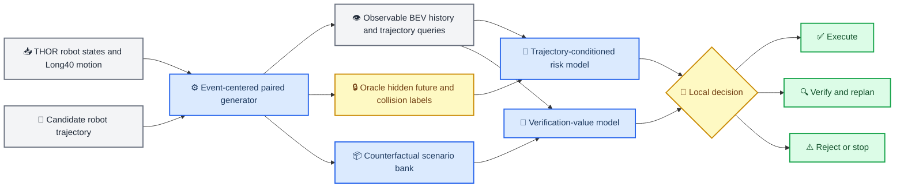

# Long40 与 SOP05R lightweight TEB 工作交接

_供接手本项目的 Agent 使用；记录论文主线、40 帧迁移和 SOP05R 实际工程状态，更新于 2026-07-26_

---

## 📌 交接结论

接手者应先记住四件事：

1. 论文研究的是：机器人在遮挡下，如何在 `execute / verify / reject` 之间做局部规划决策。
2. 当前生产时间契约已经改为 **Long40 / Schema `4.0.0`**：动态对象共 `40` 帧，其中 `8` 帧历史含当前帧，决策后有 `32` 个未来端点，覆盖 `0.2–6.4 s`。
3. SOP05R 的 M1–M6 核心路径已经能用真实 THOR Long40 行人片段构造并发布 M6 母事件；但整个仓库尚未迁移完成，M7 测试夹具、M8 验证动作和 M9 SOP06 handoff 仍有明确的旧契约断点。
4. 当前 5 个 M6 样本只是工程 smoke：行人轨迹是真实 THOR Long40，但机器人场景来自确定性的 M4 测试模板；它不能作为正式产率或论文结果。

> ⚠️ **证据边界：** 主实验尚未运行。本文档记录工程事实，不把 smoke、测试通过数或半合成样本当作论文性能证据。

## 📚 权威顺序与已过时文档

| 优先级 | 文档 | 用途 | 注意事项 |
| --- | --- | --- | --- |
| 1 | [Long40 统一时间与数据契约](../../../long40_system_contract.md) | SOP-03 至 SOP-16 的时间、shape 和版本权威 | 与其他文档冲突时以它为准 |
| 2 | 本文档 | 当前工作树和 SOP05R 实际交接状态 | 只在获得新代码、测试或产物证据后更新 |
| 3 | [方法实现规格](../../../event_centered_blind_spot_implementation_spec.md) | 论文问题、数据语义、风险和验证价值定义 | 个别历史段落可能仍需继续清理 |
| 4 | [SOP05R full spec](./full-spec.md)、[contracts](./contracts.md)、[milestones](./milestones.md)、[acceptance](./acceptance.md) | `obstacle_first_teb` v3 的设计与验收要求 | 里程碑描述不等于代码已经完成 |
| 5 | [Agent SOP](../../../event_centered_blind_spot_agent_sops.md) | 整体 SOP-00 至 SOP-16 的任务组织 | Long40 时间语义受优先级 1 覆盖 |
| 6 | [`paper/aaai_main_draft.md`](../../../../paper/aaai_main_draft.md) | 论文叙事草稿 | 开头仍写“schema-3”，时间状态已过时；实验数字仍是未测目标 |

以下文件不能用来判断当前实现完成度：

- [`state.md`](./state.md) 的主体是“只改文档、尚未审计代码”时的历史快照
- `paper/research/PAPER.md` 和 `paper/research/logic/claims.md` 仍把经验缺口写成 Schema 3
- 早期使用 `23` 样本、`15` future 或 `3.0 s` horizon 的计划只用于追溯

## 💡 论文主线

### 一句话问题

候选局部轨迹将穿过当前不可观测区域时，机器人既要估计该轨迹的隐藏风险，也要判断一次短时验证动作带来的决策收益是否足以抵消时间和运动成本。

### 一句话方法

从真实机器人状态和真实 typed 动态对象运动片段出发，围绕候选轨迹上的潜在冲突构造事件中心的配对遮挡场景，用 oracle 世界生成轨迹条件风险和反事实验证价值标签，再学习 `execute / verify / reject` 决策。



### 三个主要贡献方向

1. **事件中心的配对隐藏风险生成**
   - 自然数据中遮挡冲突稀少，因此先选潜在冲突，再反向构造遮挡和目标
   - 保留真实 typed 运动先验，构造 collision、near miss、时序安全、空间安全、无关隐藏对象和空盲区等对照
   - 配对设计用于检验模型是否真正学习同步的轨迹风险，而不是盲区面积或空间交叉捷径
2. **轨迹条件的校准隐藏风险**
   - 输入是部署时可获得的 8 帧 BEV 历史、当前状态和候选轨迹 query maps
   - 输出风险严重度分位数和碰撞 likelihood
   - 主方法直接预测 trajectory risk；完整 occupancy prediction 是 baseline 或可选辅助任务
3. **反事实净验证价值**
   - 对每个短时验证动作，在 scenario bank 中模拟新观测、更新 world 权重并重新规划
   - 标签是验证前后经验决策损失之差，再减一次动作成本
   - 在线根据风险和价值在执行、验证、拒绝之间选择

### 模型输入与 oracle 标签必须隔离

模型输入只能包含模拟传感器在决策时刻及过去能看到的内容。以下信息只能用于离线标签：

- 隐藏对象完整未来
- 连续碰撞结果、最近距离和首次碰撞时间
- scenario bank 的真实 world identity
- 反事实动作在每个 oracle world 下产生的未来观测和损失

未来 `32` 帧用于标签和轨迹查询的时间轴，不意味着模型能看到目标未来。SOP-07 的历史输入仍只有 `8` 帧。

### 论文可以和不可以声称什么

目标主张尚需正式实验支持：

- 轨迹条件风险优于 occupancy prediction 加聚合
- 配对 hard negatives 减少时序和盲区捷径
- 反事实净验证价值优于可见面积、信息增益或 always-verify 策略
- 校准与闭环决策减少 false-safe execution 和不必要验证

不得声称：

- scenario bank 是真实 Bayesian posterior
- \(G^*\) 是严格 Bayes ground truth
- 连续 risk severity 是真实碰撞概率
- 方法提供无条件安全保证
- 半合成分布等价于真实世界分布

## ⏱️ Long40 冻结契约

### 共享模型和数据时间轴

| 属性 | 冻结值 |
| --- | --- |
| Schema | `4.0.0` |
| 动态对象 layout | `history8_current7_future32_v1` |
| 总样本数 | `40` |
| 采样间隔 | `0.2 s` |
| 历史含当前 | `8` 帧，索引 `0..7` |
| 决策当前帧 | 索引 `7`，时间 `0.0 s` |
| 决策后未来 | `32` 个端点，索引 `8..39` |
| future endpoint times | `0.2, 0.4, ..., 6.4 s` |
| snippet 总时长 | `7.8 s` |
| `LocalTrajectory.poses` | `[32, 3]` |
| `LocalTrajectory.controls` | `[32, 2]` |
| event target motion layout | `event_target_motion_history8_future32_v2` |

### SOP05R 的双时间域

SOP05R 同时出现两个“40”，但语义不同：

| 对象 | 时间范围 | 数量 | 坐标系 | 用途 |
| --- | --- | --- | --- | --- |
| 动态对象 `LongMotionSnippet` | `-1.4–6.4 s`，含当前 | 40 个样本 | 变换后的场景坐标 | 历史、目标未来和标签 |
| `PlannedTebRoute` | 源状态后 `0.2–8.0 s` | 40 个端点 | 源世界坐标 | 可达性、碰撞锚点、到达目标和溯源 |
| `LocalTrajectory` | 决策后 `0.2–6.4 s` | 32 个端点 | 决策局部坐标 | 模型输入、query maps、标签和验证 |

`PlannedTebRoute` 不能直接当作 `LocalTrajectory`。M6 必须在 index 7 的决策时刻截取并重定位准确的 32 步后缀；遮挡 witness 仅作独立历史证据。

### 决策时刻的含义

决策时刻不是机器人路线起点，也不是强制指定的“行人刚进入遮挡区域”：

- `history[7]` 是固定模型决策时刻，不要求被遮挡
- 历史窗口至少 4 帧可见、至少 1 帧遮挡；最后一个遮挡帧单独记录为 witness
- `initial_visible` / `initially_hidden` 仍是起始帧的独立采样层，并各自通过窗口资格检查
- 首次连续碰撞必须满足 `1.2 <= t_collision - t_decision <= 6.4 s`
- 验证动作和制动必须能在碰撞前完成；不要求重新规划计算也在该安全裕量内完成
- 验证动作消耗同一个 6.4 秒窗口，动作结束后不能重新生成第二段 6.4 秒 oracle future

### 禁止的兼容方式

- 不得把 `15` 步补零、复制终点或外推成 `32` 步
- 不得把 `32` 步截成 `15` 步
- 不得把 Schema 3 和 Schema 4 产物混入同一 collection
- 不得根据 shape 猜版本
- 不得让当前生产 loader 静默接受旧时间布局
- 不得用提前到达目标后的静止 padding 伪造 M6 的 6.4 秒运动后缀

## 🧱 SOP05R 的作用与冻结设计

SOP-05 是整个事件中心生成阶段；SOP05R 是其中新的 `obstacle_first_teb` 生成分支。M1–M10 是 SOP05R 内部里程碑，不是 SOP-01 至 SOP-10。

SOP05R 的目标是先构造一个合理的固定起点、目标和静态遮挡任务，由 target-blind lightweight TEB 生成名义路线，再把真实行人片段锚定到路线上的未来碰撞。主要冻结决策如下：

- 机器人源起点不移动，局部目标距离为 `5.0–6.0 m`
- 静态障碍以矩形和 L 形为主、圆形为辅，权重为 `0.4 / 0.4 / 0.2`
- L 形是两个矩形 primitive 的组合，不是第三种解析几何
- 矩形和 L 形相对起终点方向采用确定性的带符号 `±[15°,45°]` 旋转
- 障碍不默认居中堵住路线，直行安全走廊侵入不少于 `0.15 m`，且至少一个 primitive 与起终点中心线解析相交
- 正式路线的 represented-obstacle clearance 为 `0.15 m`
- planner 使用纯 NumPy、21 个 band poses、20 个时间间隔和唯一 `straight` 初始化
- planner 只看静态几何和机器人状态，不得读取目标轨迹或 oracle future
- M5 使用 seed 派生的有限 first-fit 搜索；空间尺度固定 `1.0`
- M6 只发布一条名义路线，不要求预先计算无碰撞 alternative

## 📍 M1–M10 实际状态

状态以当前工作树、2026-07-26 的测试和已发布 smoke 为准。

| 里程碑 | 实际状态 | 已有证据 | 仍需注意 |
| --- | --- | --- | --- |
| M1 契约和配置 | 核心完成 | v3/Schema 4 config、严格 normalizer、Long40 版本常量存在 | legacy v1 config 仍是 Schema 3，导致 2 个边界测试失败 |
| M2 typed occluder | 完成 | oriented rectangle、circle、L 形组合的解析/栅格测试进入 167 个通过测试 | 不要把 L 形改成独立 primitive |
| M3 lightweight TEB | 核心完成 | target-blind `PlannedTebRoute`、21-node band、40 endpoint route、动力学和障碍代价测试通过 | `tests/test_query_maps.py` 仍断言 `(15,3)/(15,2)`，完整全仓回归未绿 |
| M4 task templates | 完成 | 固定起点、5–6 m 目标、一侧浅侵入、矩形/L 形旋转和圆形模板已实现 | 当前 5 样本使用的是测试 helper 场景，不是正式 base-state 产率 run |
| M5 anchored human | 完成并修过崩溃 | 真实 Long40 snippet、first-fit anchor/rotation、历史可见性和决策遮挡测试通过 | `initially_hidden` 候选不满足门禁时必须拒绝，不能再恢复 assertion |
| M6 decision/mother | 核心路径完成并有 5 样本 smoke | future32 target record、decision state、32-step suffix、continuous collision、发布后严格 reload | 缺少 `6.2–6.4 s` 最后区间的专用回归；exact-horizon `endpoint_only_collision` 规则仍需与契约核对 |
| M7 publication | 运行路径可用，测试未全绿 | 5 个 M6 事件已 publish + strict reload | trajectory-store 的两个测试仍构造旧 v2/20-node fixture；没有独立的 TEB output-loader 测试文件 |
| M8 verification replan | 未完成 Long40 集成 | 部分实现和测试存在 | `verification_actions.yaml` 仍标 Schema 3；若干测试仍造 future15 |
| M9 SOP06 handoff | 未完成 | 旧路径有大量既有测试 | `sop06_pipeline.py` 仍检查 target future `(15,3)`，v3 handoff 尚未收口 |
| M10 release gates | 未开始正式实现 | 有一次临时 5 样本 PNG | 尚无 `sop05r_teb_audit.py`、`sop05r_teb_visuals.py` 或 v3 release-gate 测试；现有 visuals 仍面向旧 v1 六联 paired 路径 |

### M1–M6 关键代码

| 领域 | 文件 |
| --- | --- |
| v3 契约 | `src/generation/sop05r_contracts.py` |
| v3 配置 | `configs/generator_obstacle_first_teb_{train,test}.yaml` |
| Long40 snippet | `src/datasets/long_snippet_library.py` |
| typed occluder | `src/geometry/static_occluders.py` |
| planner | `src/planning/lightweight_teb.py` |
| M4 templates | `src/generation/sop05r_teb_templates.py` |
| M5 placement | `src/generation/anchored_human_placement.py` |
| M6 decision state | `src/generation/sop05r_teb_decision_state.py` |
| M6 mother | `src/generation/sop05r_teb_event_sampler.py` |
| future32 target record | `src/generation/event_target_motion_shard.py` |
| store/run/loader | `src/generation/sop05r_teb_{trajectory_store,run,output_loader}.py` |

### 最近两个关键修复

1. `EventTargetMotionRecord` 已从硬编码 `future15` 改为：

   ```text
   layout = event_target_motion_history8_future32_v2
   history = 8
   current_index = 7
   future = 32
   ```

2. `anchored_human_placement.py` 不再对缺失的 decision blocker 执行
   `assert blocker_id is not None`。候选现在会记录：

   ```text
   decision_not_blocked
   visible_history_insufficient
   ```

   然后继续 first-fit 搜索。对应回归测试位于
   `tests/test_anchored_human_placement.py`。

## 📦 已有数据和可视化证据

### Schema 4 THOR Long40 行人库

路径：

```text
outputs/sop03_thor_motion_snippet_long40_human_schema4_v1/train/human
```

关键摘要：

| 属性 | 值 |
| --- | --- |
| accepted snippets | `11,725` |
| candidates | `19,467` |
| recordings | `37` |
| shape | `40` samples，`8 + 32` |
| schema/layout | `4.0.0` / `history8_current7_future32_v1` |
| semantic digest | `78ed6cbe4ff1bccbaeb4d9e38413ab994ae4594af9398a04205414f7cb7e86f0` |

### 五个 M6 母事件

路径：

```text
outputs/sop05r_teb_long40_m6_five_schema4_v1
```

已验证：

- `accepted_count = 5`
- 发布后 `require_complete=True` 严格 reload 成功
- 每个目标 `future_poses.shape == (32, 3)`
- 每个 future visibility shape 为 `(32,)`
- 五个首次连续碰撞时间为决策后 `2.08–2.73 s`
- 历史可见帧数分别为 `4, 5, 4, 5, 4`，决策帧均不可见
- M6 层为 6 次尝试接受 5 个；M5 first-fit 共记录 2,863 个候选尝试并接受 6 个

这些计数只描述本次定向 smoke。生成脚本引用了
`tests.test_anchored_human_placement._m4_inputs`，因此不能把 `5/6` 或
`6/2863` 报告为一般化产率。

### 五样本 PNG

```text
.tmp/agent/outputs/m6_long40_schema4_five_samples.png
```

图例：

- 蓝线：完整 8 秒 TEB 路线
- 浅蓝粗线：32 步决策后缀
- 橙色虚线：8 帧行人历史
- 橙红实线：32 帧 THOR 行人未来
- 红叉：最近的同步 robot-human 时刻

该 PNG 由一次性内联脚本生成，尚未形成 v3 正式 visual CLI。现有
`scripts/05_render_sop05r_audit.py` 与 `src/evaluation/sop05r_visuals.py`
仍绑定旧 v1 paired-sixpack 数据结构。

## 🧪 当前测试与工作树状态

### 2026-07-26 实测结果

M1–M6 聚焦集合：

```text
167 passed, 2 failed
```

两个失败都来自 `tests/test_sop05r_teb_contracts.py`：测试调用旧
`configs/generator_obstacle_first_train.yaml`，其 Schema 仍为 `3.0.0`，
而 legacy normalizer 当前引用全局 `SCHEMA_VERSION = 4.0.0`。

M3 另有一个未包含在上述聚焦命令中的旧断言：

```text
tests/test_query_maps.py:
LocalTrajectory.poses expected (15, 3), implementation returns (32, 3)
```

这属于测试 fixture 未迁移，不应通过把实现截回 15 步解决。

M7 store/run：

```text
3 passed, 2 failed
```

失败测试仍构造 `lightweight_teb_planner_v2` 的 20-node band，而
`PlannedTebRoute` 已要求 v3 的 21-node band。

M8 revealability/counterfactual：

```text
3 passed, 6 failed
```

主要原因：

- `configs/verification_actions.yaml` 仍写 `schema_version: "3.0.0"`
- 测试仍构造 `(15, 3)` target future

M9 paired/SOP06：

```text
49 passed, 38 failed, 47 errors
```

其中一个明确硬编码是：

```text
src/generation/sop06_pipeline.py:
paired target future_poses expected shape (15, 3)
```

因此不得向接手者声称 M7–M9 已完成。

M6 还存在一个必须在扩大生成前补齐的 acceptance gap：

- 当前 sampler 会将首次碰撞时间数值上等于 `6.4 s` 的情况归为
  `endpoint_only_collision`
- 当前测试只断言碰撞时间不超过 `6.4 s`
- 尚无专门覆盖 `6.2–6.4 s` 最后 swept interval 的测试

需要构造一个能区分“离散端点碰巧重合”和“连续 swept-footprint 在最后区间首次接触”
的 fixture，再决定 exact-horizon 分支是否符合 Long40 契约；不能直接删除拒绝逻辑，
也不能继续把最后区间当作天然不可接受。

### 工作树保护

当前工作树包含大量已有的 modified 和 untracked 文件，约为：

```text
78 tracked files changed
8,380 insertions
1,659 deletions
```

另外还有多项新文件未跟踪。接手者必须：

1. 先运行 `git status --short`
2. 不执行 hard reset、checkout 覆盖或大范围格式化
3. 不删除看似“旧”的文件，先确认它是否是尚未提交的新实现
4. 不提交、不 amend、不 push，除非用户明确要求
5. 每次只修一个契约 seam，并在修前后记录聚焦测试

## ▶️ 建议接手顺序

### 第一步：先做只读 gap report

不要根据旧 `state.md` 推断“代码未开始”，也不要根据本次 5 样本推断“迁移已经完成”。先核对：

```text
long40_system_contract
→ current global schema/config
→ M1–M6 focused tests
→ M7 store fixtures
→ M8 verification action schema/future shapes
→ M9 SOP06 future15 hardcodes
```

### 第二步：清理 M1/M7 的版本边界

先决定并测试 legacy v1 的明确隔离方式：

- 当前 production 只能接受 Schema 4 Long40
- archival v1 若保留，必须使用独立常量、loader 和测试，不能依赖全局生产 Schema
- M7 fixture 应升级为 v3 的 21-node / 40-route / 32-suffix 结构

不能通过把全局 `SCHEMA_VERSION` 改回 `3.0.0` 来让旧测试变绿。

### 第三步：完成 M8

按共享 6.4 秒窗口迁移：

- verification action config/version
- counterfactual target future shape
- action 消耗原窗口的时间语义
- 同目标 TEB replan
- hidden/revealed planner request 的 oracle isolation

### 第四步：补齐 M6 最后区间回归

在 M9 扩散前先冻结：

- `6.2–6.4 s` 连续首次接触必须可被接受
- 纯离散端点重合必须被拒绝
- exact `6.4 s` 的数值容差和物理语义必须由测试明确，而不是由
  `np.isclose` 隐式决定

### 第五步：完成 M9

SOP06 当前生产 handoff 必须精确要求：

- generator `obstacle_first_lightweight_teb_v3`
- Schema `4.0.0`
- target layout `history8_current7_future32_v1`
- authenticated 40-endpoint full route
- authenticated 32-endpoint nominal suffix
- exactly one nominal plan 和同一 world-frame goal

删除或隔离所有当前分支中的 future15 假设后，再运行 paired 与 SOP06 聚焦测试。

### 第六步：最后做 M10 和正式产率

在 M8/M9 绿灯前不要把临时 PNG 包装成 release gate。M10 应新增真正读取 v3
collection 的 visual/audit 路径，然后按 `10 → 100 → 1,000` 的证据梯度执行。

正式产率必须来自真实 base-state 分布和正式生产 CLI，不能复用测试 helper。

## 🧭 给新 Agent 的建议首条指令

可以直接把下面这段作为接手 prompt：

```text
先只读 docs/superpowers/plans/2026-07-25-sop05r-lightweight-teb/HANDOFF.md、
docs/long40_system_contract.md 和该目录的 milestones/acceptance。
运行 git status --short，但不要修改、清理、提交或重置任何文件。
先给出“文档契约—代码—测试—产物”的 gap report，特别核对：
1) legacy v1 Schema 边界；
2) query_maps 和 M7 的旧 15-step/v2 测试 fixture；
3) M6 的 6.2–6.4 s 连续碰撞回归；
4) verification_actions 的 Schema 3；
5) M8 future15 测试；
6) M9 sop06_pipeline 的 (15,3) 硬编码。
得到确认后再按一个 seam 一个提交范围推进。
```
