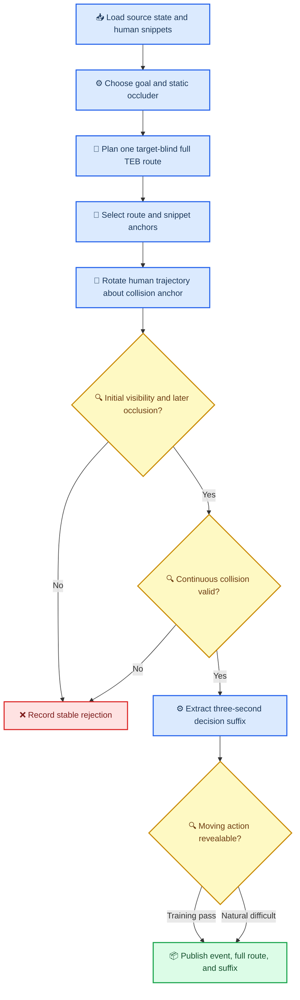
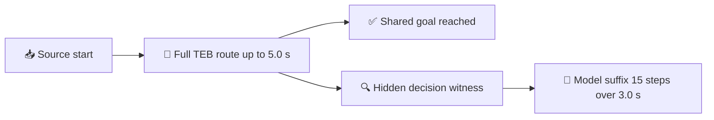

# SOP05R lightweight TEB event generation full specification

_Complete lookup specification for the SOP05R v2 redesign agreed on 2026-07-25._

---

## 📚 Document set

- [Full specification](./full-spec.md): complete method and data flow
- [Contracts](./contracts.md): interfaces and causal boundaries that implementation must not violate
- [Milestones](./milestones.md): staged implementation plan with file-level ownership
- [Acceptance](./acceptance.md): tests, commands, metrics, and release gates
- [State](./state.md): current implementation state, decisions, and next action

This document is the complete method reference. Implementation agents should start from
[state.md](./state.md), execute [milestones.md](./milestones.md), and use
[acceptance.md](./acceptance.md) as the completion authority.

## 🎯 Goal and scope

The redesign builds collision mother events with the following causal order:

1. preserve the source robot start state
2. choose a local task goal
3. place a static occluder between start and goal
4. plan one target-blind, dynamically feasible robot route with a lightweight TEB-style planner
5. bind one internal robot route sample to one internal human MotionSnippet sample
6. rotate the complete human trajectory about that fixed collision anchor
7. retain a placement whose synchronized robot-human centerline is initially visible and later blocked by an occluder
8. validate continuous collision and active revealability
9. derive the decision-relative three-second nominal suffix
10. publish the mother event, full route evidence, and single nominal suffix

The primary target type is `human`. Rectangular wall/shelf/cabinet occluders and circular
tree-trunk/column occluders are required. The planner is implemented in NumPy and must be
usable both during mother generation and after verification actions.

The redesign replaces the current provisional-target placement, corner-waypoint planner,
second target alignment, and mandatory same-goal alternative-route gate. It does not
modify legacy SOP05 behavior or silently reinterpret already published SOP05R v1
artifacts.

## 🔄 End-to-end workflow



## 🧭 Coordinates and timeline

All world-frame quantities use the existing local BEV frame and SI units:

- poses: `[x_m, y_m, yaw_rad]`
- controls: `[linear_velocity_mps, angular_velocity_radps]`
- time: seconds
- trajectory arrays: finite `float32` unless an existing geometry authority requires `float64`
- masks: existing project boolean or binary `float32` conventions

The source robot start is fixed:

```text
encounter_start_pose = base_state.robot_history[-1]
encounter_start_control = base_state.robot_state
```

The complete generated encounter has:

- `t_start`: source robot start and beginning of the planned route
- `t_occ`: one synchronized time before collision at which the robot-human centerline is blocked
- `t_collision`: the continuous first-collision time
- `t_goal`: full-route arrival at the unchanged goal, bounded by `5.0 s`
- `g`: the unchanged local task goal

For a verification event, the decision state must be bound to a hidden witness at
`t_occ`; it must not be evaluated from a time at which the target is already visible.
The implementation must persist both the full encounter provenance and the selected
decision-time witness.

### Dual-horizon rule

SOP05R v2 deliberately uses two time domains:



The full planner route is not a model input. It proves that the robot can complete the
same task after bypassing the occluder and provides the route prefix, collision anchor,
and goal-arrival evidence. The model-domain suffix starts at `t_occ`, contains endpoints
at `t_occ + 0.2, ..., t_occ + 3.0 s`, and remains under the existing Schema `3.0.0`
contract.

The decision suffix may end before the full route reaches `g`. It must bind the unchanged
goal and full-route task cost, but only the full route is required to demonstrate goal
arrival. If the full route reaches the goal before the suffix ends, the remaining suffix
samples are a deterministic stationary hold at the goal. The accepted first collision
must still occur inside the decision-relative three-second suffix; the longer planning
horizon extends task completion, not the collision-label horizon.

## 📥 Inputs

Each generation attempt consumes:

- one authenticated SOP03 `BaseState`
- its matching `OracleContext`
- the split-local typed MotionSnippet libraries
- the frozen base configuration
- the new SOP05R v2 generator configuration
- the verification-action configuration
- a deterministic unsigned seed

The human snippet source remains split-local. No train/validation/test mixing is allowed.
The source BaseState and OracleContext are immutable inputs. Generation may derive an
event decision state but must retain the source identity and transformation provenance.

## 🧱 Task geometry and static occluders

### Goal placement

The local goal `g` is sampled at a configured distance and bearing from the fixed robot
start. It must:

- lie inside the valid BEV support
- be reachable under the planner horizon and dynamics
- remain identical before and after every verification action
- be bound into the event and trajectory semantic identities

### Occluder placement

An occluder is placed near, but not centered on, the start-goal segment. The sampler
chooses a nonzero lateral side and offsets the occluder until it only shallowly intrudes
into the robot's straight-driving safety corridor. Supported shapes are:

```text
rectangle: center pose, length, width, semantic type
l_shape: two perpendicular rectangle arms, arm lengths, arm width, semantic type
circle: center, radius, semantic type
```

The frozen template-family mixture is `rectangle=0.4`, `l_shape=0.4`, and
`circle=0.2`. L shapes are composite templates: generation expands each one into two
overlapping rectangle components before M2 geometry, rasterization, and M3 planning.
Required rectangle and L-shape semantics include wall-like and shelf/cabinet-like
obstacles. Circle semantics include tree-trunk-like and column-like obstacles. Every
primitive component exposes:

- exact bounds
- signed point distance
- segment intersection
- footprint inflation
- rasterization on the frozen grid

For every rectangle and L shape, M4 samples a deterministic signed orientation relative
to the start-goal direction: `±Uniform(15°, 45°)`. The seed is derived from the source
state, frozen config digest, and template ID. It then recomputes the lateral placement
with fixed-iteration bisection, so this rotation never weakens the required
direct-corridor intrusion. Circles have no orientation.

Placement rejects any occluder that is out of bounds or intersects source static
occupancy, the preserved robot history, or protected context footprints. Let
`d_direct` be the minimum direct-line signed clearance across every represented
primitive component after subtracting the robot footprint and base inflation, and let
`c_min` be the planner's minimum represented occluder clearance. A candidate is an
obstacle-induced local planning task only when:

```text
intrusion_m = c_min - d_direct
intrusion_m ∈ [0.05, 0.15]
```

The direct route therefore violates its required safety clearance while a shallow,
one-sided obstruction normally admits a smooth detour. M3 remains the authority: the
sampler retains only candidates for which the dynamically constrained planner returns a
collision-free route to the unchanged goal.

## 🔧 Lightweight TEB-style planner

### Public behavior

The planner exposes two causal request types over one private optimization engine:

```python
plan_static_lightweight_teb(
    request: StaticTebRequest,
) -> LightweightTebResult

plan_observed_lightweight_teb(
    request: ObservedTebRequest,
) -> LightweightTebResult
```

Both request types contain:

- start pose
- initial linear and angular velocity
- fixed world-frame goal
- static occupancy
- typed static occluders
- frozen planner configuration

Only `ObservedTebRequest` contains observed dynamic obstacles. Mother generation uses
`StaticTebRequest`, which has no dynamic-object field. Hidden targets, OracleContext
futures, collision points, labels, and revealability results are forbidden planner
inputs.

The planner optimizes one deterministic straight initial band. The mandatory nonzero
occluder lateral offset gives the obstacle term a unique repulsion direction, so it does
not require left/right initialization branches. The output is
one `PlannedTebRoute` plus optimization diagnostics and stable rejection evidence.
`LocalTrajectory` construction is deferred to the M6 decision-state seam.

### Optimization variables

The band contains:

```text
q_i = [x_i, y_i, yaw_i]
delta_t_i > 0
```

The first pose is fixed to the request start and the final pose is fixed to the same
world-frame goal. Intermediate poses and time intervals are optimized under the frozen
dual-horizon schedule:

```text
band_node_count = 20
band_interval_count = 19
initial_delta_t = 0.25 s
delta_t_i in [0.1, 0.4] s
sum(delta_t_i) <= 5.0 s
full_route_sample_dt = 0.2 s
full_route_sample_count = 25
model_suffix_dt = 0.2 s
model_suffix_sample_count = 15
```

The accepted route is sampled at `0.2 s` through `5.0 s`. A stationary post-arrival
suffix is permitted, but proving an exact zero-control hold is not an M3 acceptance
criterion. This uniform full-route view is used by M4–M6, while the variable-time band
remains optimizer evidence.

### Objective

The objective combines:

```text
J =
  w_length * path_length
  + w_time * total_time
  + w_smooth * curvature_change
  + w_obstacle * clearance_violation
  + w_nonholonomic * lateral_slip
  + w_velocity * velocity_violation
  + w_acceleration * acceleration_violation
  + w_goal_heading * terminal_heading_error
  + w_initial_control * initial_control_discontinuity
```

Obstacle cost is a hinge penalty below the configured minimum clearance. It must not
continue repelling a route that already satisfies safe clearance. Route length and time
therefore naturally favor a short path near the clearance boundary; no unsafe
near-obstacle reward is permitted.

The implementation uses fixed-iteration deterministic NumPy updates and analytic
gradients for path, time, smoothness, and supported obstacle distances. It does not add
SciPy or ROS as a dependency. Every optimized result and its uniform `0.2 s` resampling
receive independent kinematic and dense sampled static-collision validation before
acceptance. Frozen clearance margins provide the conservative allowance between sampled
states.

## 🎯 Collision anchor selection

After a route is available, generation chooses:

- a robot route sample or interpolated point `j`
- its encounter time `t_collision`
- one internal human MotionSnippet anchor index `k`

The anchor must not be the first or last human sample. The robot anchor should be inside
the configured path-fraction range and leave enough route after collision for auditing.
The human anchor time, after any allowed bounded temporal resampling, must equal the robot
anchor time.

The anchor is a constraint, not a planner input. The robot route is already fixed before
the target is joined.

## 🔄 Anchored human rotation

Let the source human positions be `P_i`, and let `P_k` be the selected source anchor.
After translating `P_k` to the world collision point `j`, a rotation candidate is:

```text
P'_i(theta) = j + R(theta) * (P_i - P_k)
```

For every angle:

```text
P'_k(theta) = j
```

The collision anchor therefore remains fixed while the complete history and future sweep
around it. Headings and velocity vectors receive the same rotation. Rigid translation and
rotation preserve trajectory length, speed magnitude, acceleration magnitude, and local
turn geometry.

SOP05R v2 forbids spatial scaling in its primary path. A bounded temporal scale may be
used only when it belongs to the frozen configuration, remains within source support,
preserves the event layout, and passes human speed and acceleration limits.

### Bounded angle search

The placement solver evaluates a deterministic schedule:

1. coarse angles over `[0, 2*pi)` at the frozen coarse step
2. stable scoring of valid coarse candidates
3. local refinement around the best configured number of coarse candidates
4. exact validation of the highest-ranked candidate

All angle candidates are transformed in one vectorized array with shape
`[angle_count, sample_count, 2]`. A candidate is rejected early when it leaves the BEV,
intersects an occluder or source static occupancy, collides with context motion, or
violates the target physics contract.

## 👁️ Centerline visibility and occlusion

The authoritative fast scene-generation predicate uses synchronized robot and human
centers. It intentionally tolerates the small approximation error caused by ignoring
partial target-footprint visibility.

For one time `t`:

```text
blocked(t) =
    any static occluder intersects segment(robot_center(t), human_center(t))
```

For the primary `seen_then_occluded` encounter:

```text
blocked(t_start) == false
exists t_occ where t_start < t_occ < t_collision and blocked(t_occ) == true
```

One blocked synchronized sample is sufficient. Consecutive hidden frames, an all-hidden
tail, and footprint-level full occlusion are not generation requirements. For the
secondary initially-hidden stratum, the configured initial sample is blocked and the
event still needs a valid hidden decision witness before collision.

Circle intersection uses the closest point from the circle center to the line segment.
Oriented-rectangle intersection transforms segment endpoints into obstacle-local
coordinates and applies a slab intersection. Multiple occluders use logical `any`.
Candidate evaluation exits as soon as a valid witness is found.

The selected witness must leave the configured verification-action, braking, and
replanning margin before collision. It is persisted as:

- witness time
- synchronized robot and target poses
- blocking occluder ID
- centerline-intersection method version
- start visibility result

Existing footprint raycasting remains an audit metric. Disagreement with the centerline
predicate is reported but does not silently change the authoritative v2 event contract.

## 💥 Collision and physical validity

The target and robot must collide continuously at the bound anchor. Discrete equality at
one sample is insufficient. Existing footprint-based continuous interpolation remains
the collision authority.

An accepted mother requires:

- target and robot anchor times agree
- target and robot footprints have a continuous collision
- first collision lies in the configured time and route-fraction ranges
- collision is not an endpoint-only horizon artifact
- target does not intersect static occluders before collision
- target does not collide with protected context motion
- target speed and acceleration remain within the frozen human policy

The initial planner returns one nominal full route. A precomputed same-goal
non-collision alternative is not required. The current `no_same_goal_alternative`
rejection is removed from the v2 path only.

## 🔍 Verification and same-goal replanning

The same lightweight TEB implementation is called from every verification-action
terminal state:

```text
pre-verification:
    static obstacles only

post-verification, target still hidden:
    static obstacles only

post-verification, target observed:
    static obstacles plus deployment-available observed target state/prediction
```

All calls retain the exact same world-frame goal, five-second full-route bound, and
task-cost definition. Oracle future motion is never passed as an observed dynamic
obstacle. The label-side evaluator may use the hidden world only to score realized loss
after the planner output is fixed. Verification-value risk remains restricted to the
three-second Schema `3.0.0` window following the corresponding decision/action state.

Training selection may require a configured active-revealable fraction. Active
revealability remains a label-side generation/audit field, not a planner or model input.
Validation and test sets report the natural fraction without filtering on the best
verification action.

## ⚙️ Search order and efficiency

The bounded search order is:

1. base state
2. goal and occluder template
3. lightweight TEB route
4. route collision anchor
5. human snippet and internal anchor
6. coarse anchored rotations
7. refined rotations
8. exact visibility, physics, and continuous-collision gates
9. active-revealability audit

Failures at an earlier, cheaper layer do not enter a later layer. Planner output is cached
by source state, goal, static occupancy, occluder geometry, initial control, and planner
config digest. Human rotation attempts reuse that route and never re-run the planner.

Required denominator counters include:

- source base-state count
- goal-occluder template count
- geometry-eligible template count
- TEB attempted and successful count
- route-anchor candidate count
- snippet-anchor candidate count
- coarse and refined rotation count
- initial-visible count
- any-occlusion-witness count
- continuous-collision mother count
- active-revealable mother count
- selected and published count

## 📦 Outputs and provenance

Each accepted event publishes:

- source base-state identity
- derived decision-state identity when decision rebasing is used
- fixed goal
- typed occluder geometry
- planner version, config digest, optimizer diagnostics, and five-second full route
- decision-relative three-second `LocalTrajectory` suffix and query maps
- source snippet identity and split
- human anchor index
- collision position and time
- rotation angle and temporal scale
- spatial scale fixed to `1.0`
- start-visibility evidence
- occlusion witness evidence
- continuous-collision evidence
- active-revealability evidence
- source-code identity and checksums

The v2 trajectory record contains one full task route and one nominal decision suffix.
They are two views of the same planned task, not alternative routes. Old SOP05R v1
records with mandatory alternative IDs are not loaded as v2 and are never mixed into a
v2 collection.

## 🚫 Explicit prohibitions

- do not move the source robot start independently of its BaseState
- do not plan with target, OracleContext future, collision, or label inputs
- do not plan on an empty map and add the occluder afterward
- do not place a provisional target before planning and then silently replace it
- do not use arbitrary spatial trajectory scaling
- do not accept a discrete-only or endpoint-only collision
- do not require multiple public initial routes
- do not serialize the full five-second route as a Schema `3.0.0` `LocalTrajectory`
- do not require the three-second model suffix to reach the goal
- do not lower revealability thresholds to manufacture positive actions
- do not reuse v1 manifests, digests, or completion markers for v2
- do not approve target-scale generation before the staged gates in
  [acceptance.md](./acceptance.md) pass
